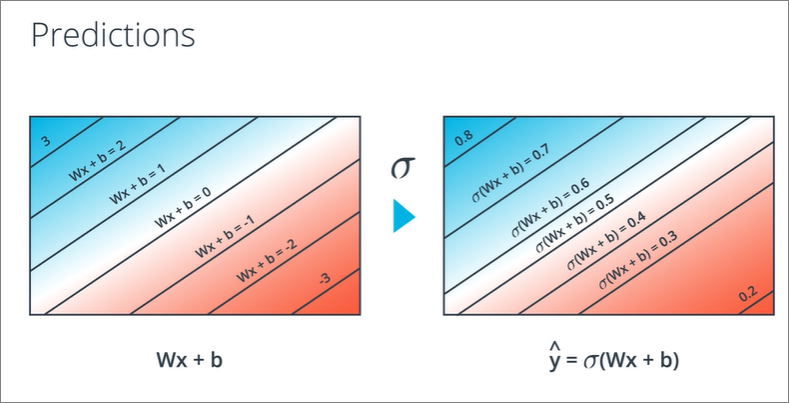
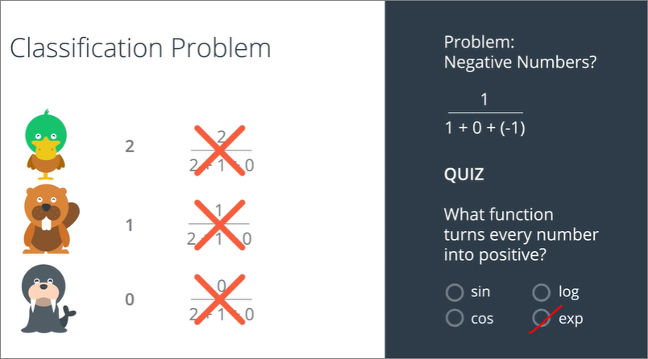
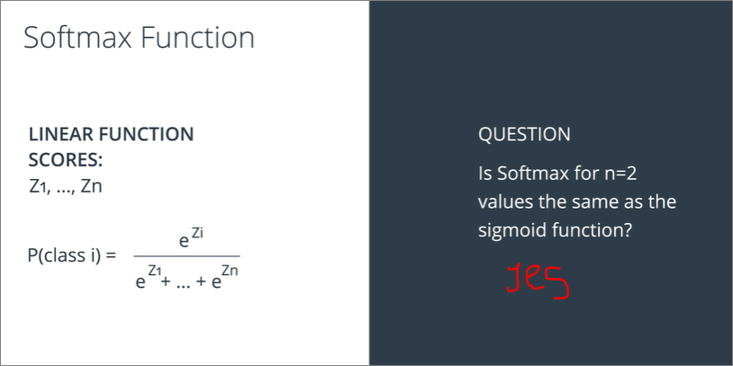
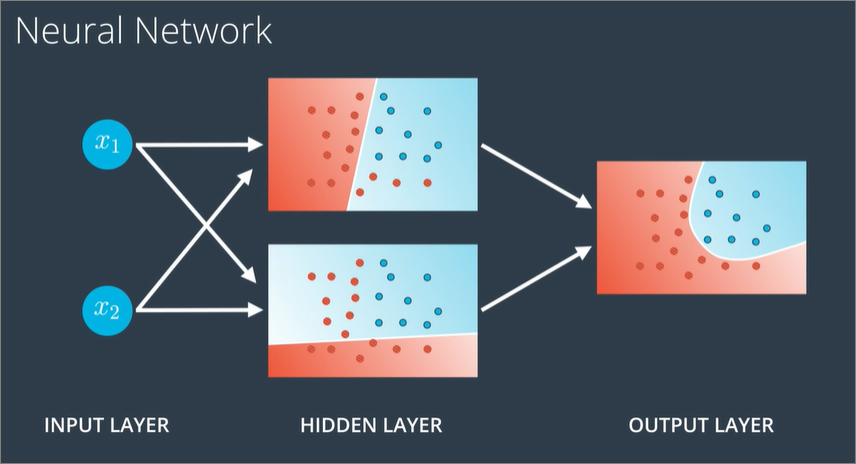
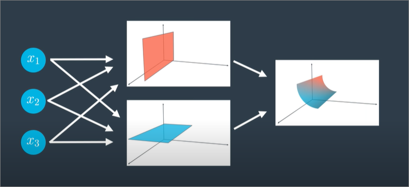
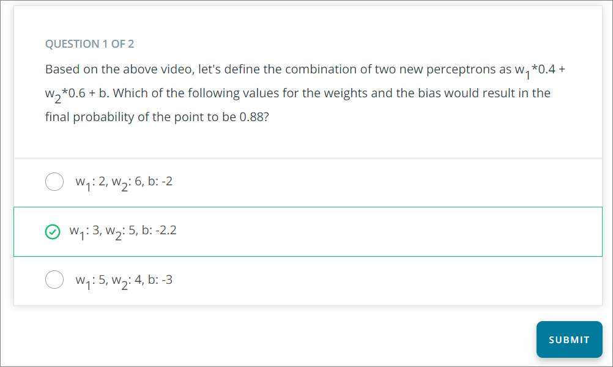

- [Neural Networks](#neural-networks)
  - [Perceptrons](#perceptrons)
    - [Why Neural Networks?](#why-neural-networks)
    - [Shifting from AND to OR](#shifting-from-and-to-or)
    - [Non-linear regions](#non-linear-regions)
  - [Error functions](#error-functions)
    - [Reminder](#reminder)
    - [Discrete & Continuous](#discrete--continuous)
    - [Moving discrete predictions to continuous predictions](#moving-discrete-predictions-to-continuous-predictions)
    - [New perceptron](#new-perceptron)
    - [Sigmoid quiz](#sigmoid-quiz)
  - [Softmax](#softmax)
    - [Classification problem](#classification-problem)
    - [Softmax function Code](#softmax-function-code)
  - [One-hot encoding (reminder)](#one-hot-encoding-reminder)
  - [Maximum Likelihood](#maximum-likelihood)
    - [Example](#example)
    - [Quiz](#quiz)
    - [Relating maximum likelihood with error function](#relating-maximum-likelihood-with-error-function)
  - [Cross-entropy](#cross-entropy)
    - [Example to visualise total probabilities across different scenarios](#example-to-visualise-total-probabilities-across-different-scenarios)
    - [Cross-entropy code](#cross-entropy-code)
  - [Multiclass cross-entropy](#multiclass-cross-entropy)
    - [Quiz](#quiz-1)
  - [Logistic Regression](#logistic-regression)
    - [Steps](#steps)
    - [Defining error function](#defining-error-function)
    - [Minimising error function](#minimising-error-function)
    - [Gradient Descent Exercise](#gradient-descent-exercise)
  - [Gradient descent vs Perceptron algorithm](#gradient-descent-vs-perceptron-algorithm)
  - [Continuous Perceptron summary (not discrete as the previous perceptrons)](#continuous-perceptron-summary-not-discrete-as-the-previous-perceptrons)
  - [Non-linear regions](#non-linear-regions-1)
  - [Neural network architecture](#neural-network-architecture)
    - [Creating non-linear models by **Combining regions**](#creating-non-linear-models-by-combining-regions)
    - [Applying weights to models](#applying-weights-to-models)
    - [Summary](#summary)
    - [Multiple layers](#multiple-layers)
    - [Multi-class classification](#multi-class-classification)
    - [Quiz of summary](#quiz-of-summary)
  - [Feedforward](#feedforward)
- [Reminder](#reminder-1)
- [TODO](#todo)
- [Numpy](#numpy)

## Neural Networks
### Perceptrons
Refer to `Perceptrons` in <ins>supervised learning</ins> 

#### Why Neural Networks?
- Perceptrons mimic neurons in our brain
- Perceptrons will be joined/concatenated, where output of one neuron will be treated as input of another


#### Shifting from AND to OR


#### Non-linear regions


### Error functions
#### Reminder
1. Something that tells us how far are we from solution
2. Use error function to take small steps to solution
3. We take tiny steps (which are calculated by derivatives)

#### Discrete & Continuous
- Error functions need to be continuous
  - It would be hard to move in small increments if our error function constantly outputs the same results
  - In example below, its as if going down in Aztec pyramid (discrete) vs mount everest (continuous), steps taken in aztec may produce error score
- Another consideartion is that error functions need to be diffential, but we will revisit this after


- Visualisation using graph


#### Moving discrete predictions to continuous predictions
- Here = continous represents possibility of correct classification based upon distance of point to line


- We can convert our **step function** to a a **sigmoid function**
  - This returns a value closer to 1 for high positive
  - returns value closer to 0 for high negative
  - Reurns 0.5 if value is zero




#### New perceptron
- Now instead of answering whether the **student is accepted** (discrete)
- We can know the **probability of student getting accepted**


#### Sigmoid quiz
- find values where equation = 0, i.e. 50%


### Softmax
- It converts the scores to a **normalized probability distribution**, which can be displayed to a user or used as input to other systems
- Previously, understood that models may output, either:
  - binary - 1 / 0
  - probability - % via sigmoid

#### Classification problem
- For classification problems with 2 outputs, we can easily use the sigmoid function above to convert 


- However, classification models tend to provide scores, and scores can be both **negative** and **positive**
- If scores are all positive, we can easily take the output with the highest proportion and treat that as as output with the highest probability.


- If score are a mix of negative and positive it is not straightforward to do that. We use exponential to convert any number to a positive


- For multiclass classification problems require this formula


- This is the **softmax function**
- softmax n=2 is same as sigmoid function


#### Softmax function Code
```
import numpy as np
import math

# Write a function that takes as input a list of numbers, and returns
# the list of values given by the softmax function.
def softmax(L):
    lst_exp = []
    lst_prob = []
    for i in L:
        lst_exp.append(math.exp(i))
    for j in lst_exp:
        lst_prob.append(j / sum(lst_exp))
    return lst_prob
```

### One-hot encoding (reminder)


### Maximum Likelihood
- Used for comparing models

#### Example
- Using sigmoid function to calculate probability 
- In this case since it is a binary classification, `P(red) = 1 - P(blue)`


- Using probability of correct classification to compare models. Formula as follows, i.e. multiplying probabilities of all points


#### Quiz
- A high value of `P(all)` indicates that the model is performing well in classifying points. It **does not** mean that all points are classified correctly

#### Relating maximum likelihood with error function
- Inversely related where a **higher maximum likelihood** means **lower error**
- In examples above, there are only a few datapoints, however, when considering a very large dataset, our probabilities will be very very small (e.g. 0.000000001), so multiplying probabilities to obtain maximum likelihood may not be the best option
- Instead, we can use **log** to compute log probability by converting **multiplication to addition** (used similar concept in entropy)
  - where `P(ab) = P(a) * P(b)` can be
  - `log(ab) = log(a) + log(b)`

### Cross-entropy
- log of probability will always return negative, since log of numbers below 1  is always negative
- Hence cross-entropy is also called [**negative log likelihood/probability**](https://stats.stackexchange.com/questions/198038/cross-entropy-or-log-likelihood-in-output-layer) 
- The better our classification, the lower the score of negative log likelihood, i.e. it is inversely related
  - **For our error function**, We now then minimise cross-entropy instead of maximising 'maximum likelihood' (probability) 


- Here we can calculate individual log probabilities for each point, similarly `lower log probability = better classification`, higher the inverse


#### Example to visualise total probabilities across different scenarios
- This calculates total probabilities for best case scenario, i.e. `[gift, gift, no-gift]`


- Visualising in terms of all permutations
    - lower `-ln` = higher probability
    - All permutations would add up to `1.0`
    - `X` represents no gift


- Formula, looks alot but pretty straightforward
  - has `y = 1`, so that `yln(p) + (1 - y)ln(1 - p)` in formula below would only consider either `0 or 1` for the case of y. (basically an **if else** statement depending on the **outcome**)
  - In notation `CE[(1,1,0), (0.8,0.7,0.1)]`, will always state probability of `y = 1` **occuring**, i.e. p and not 1 - p


#### Cross-entropy code
```
import numpy as np
from math import e, log

# Write a function that takes as input two lists Y, P,
# and returns the float corresponding to their cross-entropy.
def cross_entropy(Y, P):
    sum_neg_likelihood = 0
    for i, prob in zip(Y, P):
        res = log(prob, e) if i else log(1 - prob, e)
        sum_neg_likelihood += res
    return -sum_neg_likelihood
```

### Multiclass cross-entropy
- Previously, outcome is either 0 or 1, yes or no
- Intuitively nothing changes from how to compute CE (cross-entropy)


- Formula
  - Basically if n=2, its the same formula as the earlier formula


#### Quiz
- Cross-entropy is inversely proportional to the total probability of an outcome.

### Logistic Regression
- Popular and a building block of deep learning -> **Logistic Regression**

#### Steps
1. Take your data
2. Pick a random model
3. Calculate the error
4. Minimize the error, and obtain a better model

- FYI, this is referenced towards the end of logistic regression, lesson25


#### Defining error function 
- Follow up from error function earlier
    - underlined portion represents CE function for 2 outcomes explained earlier, i.e. the **if else** statement should `y_hat` be 1 or 0
    - Error function is the **average CE of all points**


- Substituting the sigmoid function into `y_hat` (similarly to how we substitute `y=mx+b` for linear regression)


- Reminder, the above so far is for a binary CE
- multi-class CE has a different formula


#### Minimising error function
- use **Gradient descent GD**
1. Similarly as linear regression, we start at a random point (with random weights, `W`, `b`)
2. Obtain new weights (`W'`, `b'`), W prime, b prime
3. Repeat


- Formula


- in summary
  - derivative of weights = `-(y_hat - y)x` or `(y - y_hat)x`
  - derivative of bias = `-(y_hat - y)` or `(y - y_hat)`


#### Gradient Descent Exercise
- `sigmoid`: The sigmoid activation function.
- `output_formula`: The formula for the prediction.
- `error_formula`: The formula for the error at a point.
- `update_weights`: The function that updates the parameters with one gradient descent step.

- refer to exercise ipynb

### Gradient descent vs Perceptron algorithm
- They are basically very similar
  - Gradient descent takes in values **between** 0 and 1 for `y_hat`
  - Perceptron takes in either 0 **or** 1 for y_hat


- However, if all points are correctly classified, the perceptron algorithm would **not do anything**
- Gradient descent will still move the line **further away** if points are correctly classified
- And as we know, lines move closer to misclassified points


### Continuous Perceptron summary (not discrete as the previous perceptrons)
1. Takes in input(s)
2. Uses the sigmoid function for its input
3. Returns probability


### Non-linear regions
- Some distuations data cannot be split by line
- This is where neural networks (**or Multi-Layer Perceptrons**) come into play


### Neural network architecture
#### Creating non-linear models by **Combining regions**
- We can imagine combination of linear models to create a curve model
- Reminder: a linear model is a **whole probability space**, where each point would have a probability of belonging to a final classification


- We can sum up probabilities of points to arrive at a final function, since summed up number is more than 1, we apply the **sigmoid function to change number to a** probability


#### Applying weights to models
- We can apply weights to models to emphasize on certain nodes, here the upper model has weight 7 and lower a weight 5


#### Summary
- In a single linear model, we have a **linear combination** of <ins>inputs</ins> applied with weights + bias
- Now, its as if the final model is a **linear combination** of the <ins>previous 2 models</ins> with applied weights and + bias
  - We can also think of it as the line between the **two models**
- This is the **heart of neural networks**
-   Where we can visualise models in the form of perceptrons


- Combined neural network


- Notation where left = simplified of above
- Right has bias represented as a separate node


#### Multiple layers
Neural network layers
1. Input layer - initial model inputs
2. Hidden layer - layer of linear models
3. Output layer - combined linear models to a final model



- To make layers more complex, we can either
    1. **Add more nodes** to the input, hidden, and output layers.
    2. **Add more layers**.

- Other types of architectures
  1. More hidden layer nodes than input nodes as we want to shape our output better


   2. Less hidden layer nodes than input nodes as we want to have a model of **3 dimensional space**


    3. Add more output layers - lets say we want a **multiclass classification model** if our inputs are 2


    4. Add more layers to create deep neural networks. Linear models (layers) combine to create non-linear layers, so our output shape is much different. We can do this alot of times


#### Multi-class classification
- For binary classifications, models perform really well where they will output a certain probability


- For multi-class, an option is to create neural networks for all possibilities. And run softmax function to find the best probability among all. However this is overkill


- Instead, we can add more nodes in our output layer, and compute softmax towards the end 


#### Quiz of summary
1. 
2. To classify 26 letters you will need 26 nodes in the output layer. (Alternatively, 52 nodes for 26 uppercase and 26 lowercase letters)

### Feedforward
- Process neural networks use to **turn the input into an output**

## Reminder
- CE = negative log likelihood
- error function = average CE / average negative log likelihood

## TODO
- not important but good idea to understand how mathematical notations are written?
- Derivation of gradient descent
  - To revisit gradient descent formulas
- How is sigmoid 1.5  = 0.82 intuitively?
  - 1.5 = 0.8 + 0.7

## Numpy
- learn `matmul`, `multiply`