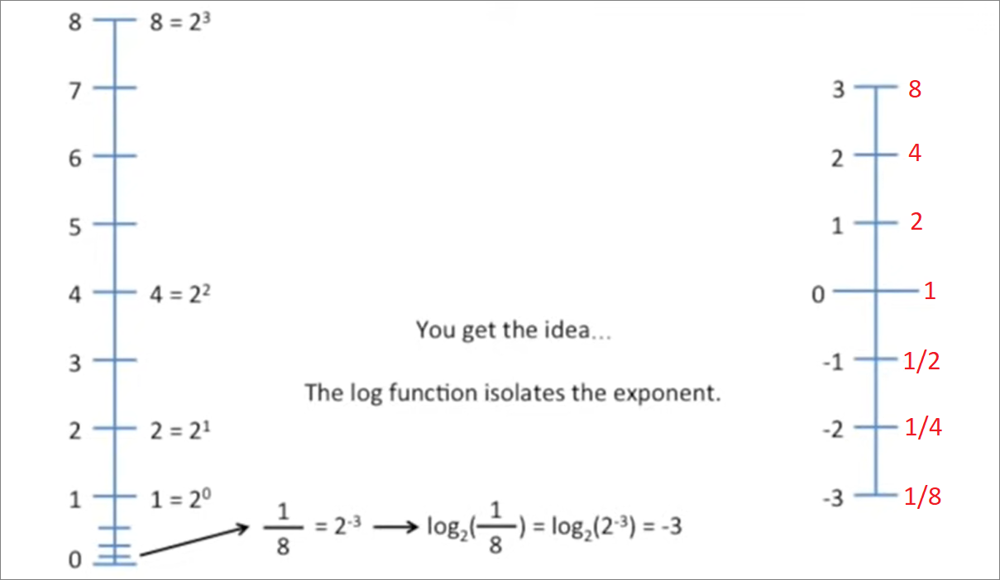
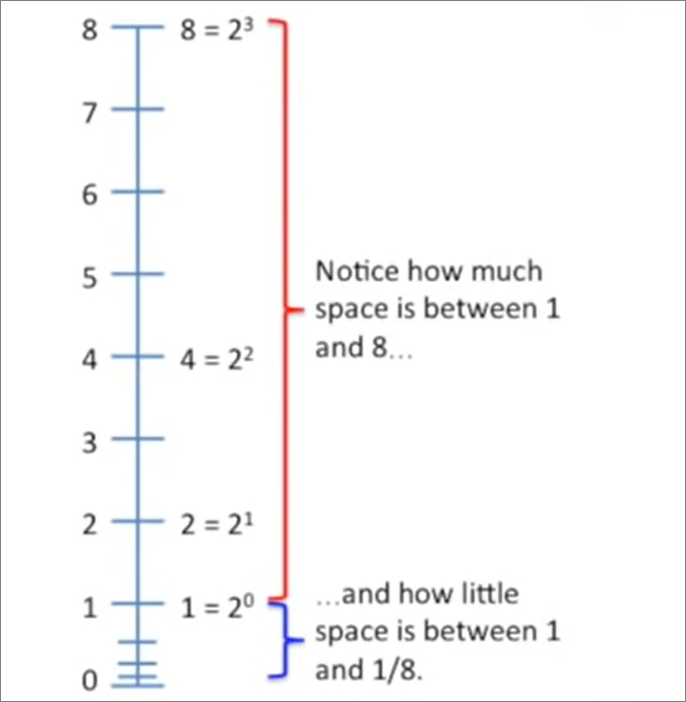
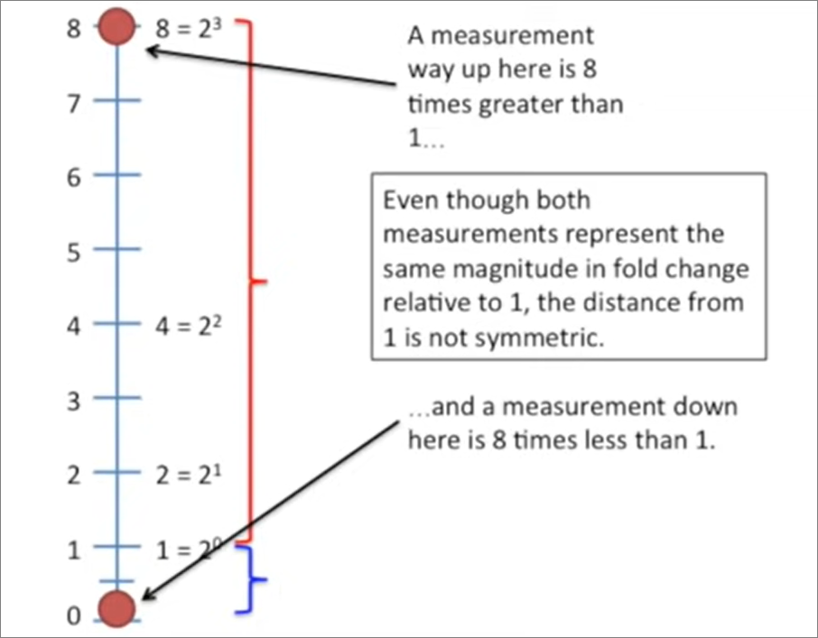
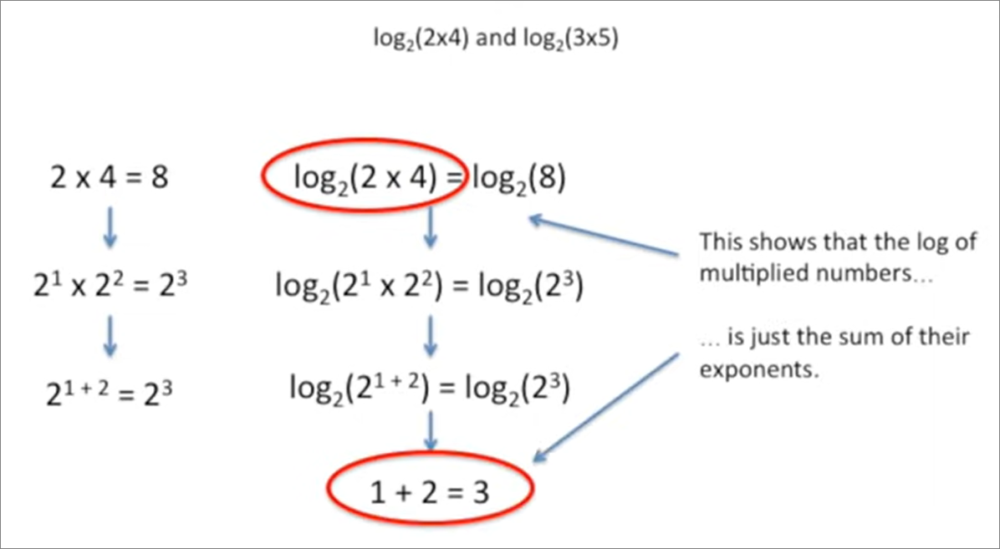
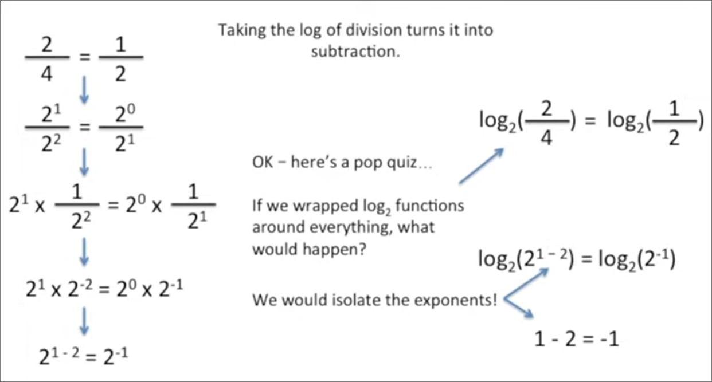
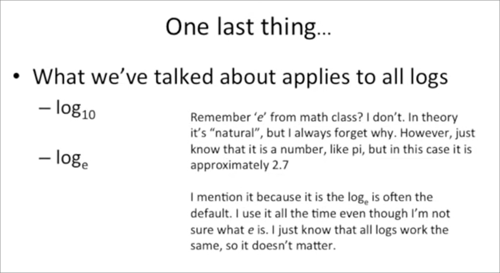

### Reference
- [Statquest](https://www.youtube.com/watch?v=VSi0Z04fWj0&t=493s&ab_channel=StatQuestwithJoshStarmer)

### Visualising log from base 10 to base 2
- In number line below, 8, 4, 2, 1 is easily rewritten as powers of 2, others can also be rewritten but not as tidy, e.g.
  - `7 = 2^2.8`
  - `6 = 2^2.6`
  - `5 = 2^2.3`
- Converting from base 10 to base 2 linear plot
  - rewrite 8 as 2^3
  - log2(8) is the exponent we need to raise 2 by to get 8
  - since that equals to log2(2^3), log2(8) = 3
  - log function just **isolates exponent**
- Main takeaways
  - log function just **isolates exponent**
  - Use log scale/axis when talking about fold change. This puts **positive and negative** fold changes on a symmetric scale.
- Converting to linear plot
    
- Distance in base 10 is not symmetrical
    
    
- Distance in base 2 is symmetric/equidistant
    

### No value for logx(0)
- No exponent such that x^e = 0
- e.g: although 1/2^1,000,000 is super tiny, it is still not zero
- Some programming languages says - `logx(0) = -infinity`
  - 1/2^infinity is smallest number we can imagine

### Arithmetic
1. Multiplication
    - similar as adding their exponents

2. Division
    - subtracting exponents

### What base?
- Don't need to worry so much about what base to use
- Default is `e`

