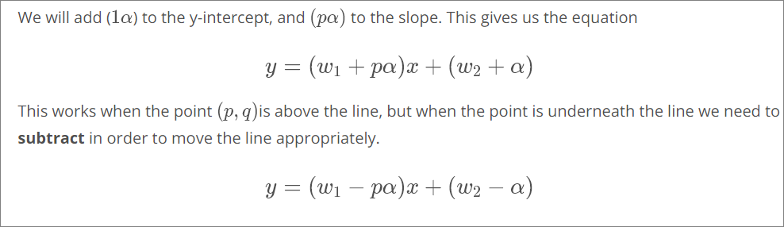
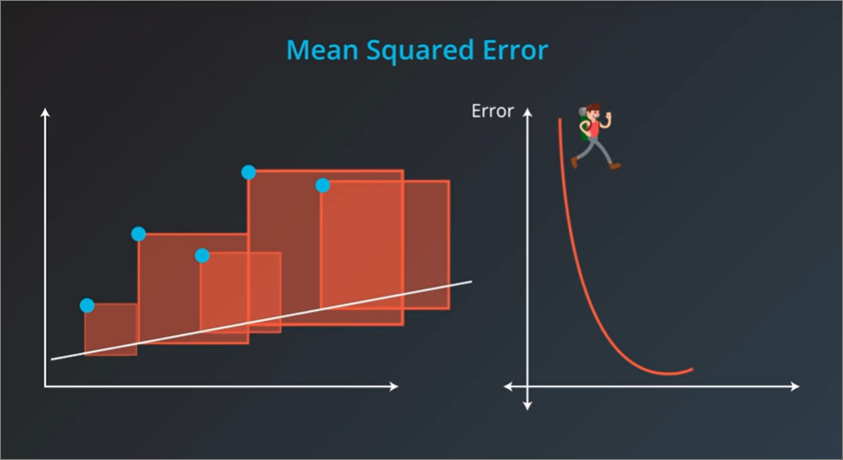
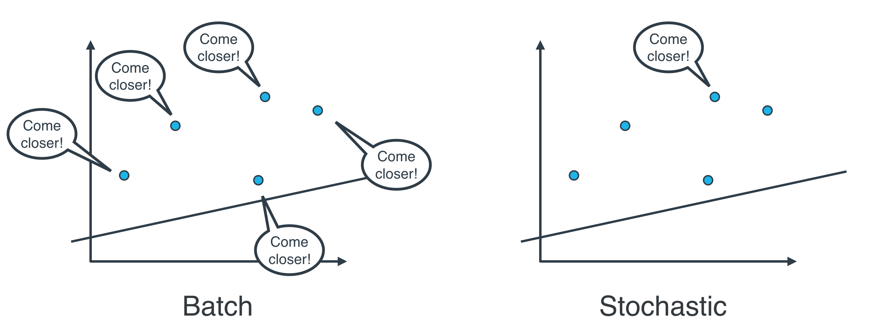
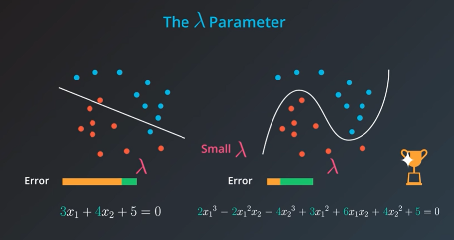

## Summary

### Main families of predictive ML:
1. Classification
    - Classification answers questions of the form yes-no. For example, is this email spam or not, or is the patient sick or not.
2. Regression
    - Regression answers questions of the form how much. For example, how much does this house cost? Or how many seconds do expect someone to watch this video?

3. Focus of linear regression only for **Regression problems**

### General idea
1. Based on idea of drawing best fitting **line** through our dataset.
2. Best line equation will be found
3. Equation will be used to plot **new data**
4. Rarely is the line perfect, but there are tools to help to determine:
    - how close we're getting to **best fitting line**
    - if line is in **best possible place**
    - **best possible shape**
    - **best possible slope**

### Visualisation over example

### Lesson outline
1. Fitting a line through data
2. Gradient descent
3. Errors
4. Linear regression in Scikit-learn
5. Polynomial regression
6. Regularization
7. Feature scaling

#### Fitting a line
1. To fit a line that is the **closest to all the points**
2. The idea is that we take a few steps that make us go closer to all the points

#### Moving lines
- I.e. tweaking weights, in this case the **slope** and the **y intercept**

#### How to move line closer to points
1. Absolute trick
    - moves lines based on constant value, i.e. 1 x alpha
    - Starts with:
        1. A point with coordinate (p, q)
        2. Line represented by y = mx + c
    - 2 steps
        1. add to the y-intercept so that the line moves up
        2. add to the slope to make the line rotate in the direction of the point
    - Utilize **learning rate** referred to as alpha (`α`) to take smaller steps

    

2. Square trick
    - in contrast to absolute trick, square trick:
      - considers how far point is from line (absolute trick doesn't since it just considers horizontal distance)
    - Difference calculated between `p` and `p'` takes care of signage, so we don't need to think before using either of the two formulas

    

#### Error functions for linear regression
1. Mean absolute error
    - calculates perpendicular distance, i.e. **y** (not actual distance) to the line
    - Absolute, i.e. negate negative

        
        

    - To measure best fit line using MAE
        
        

2. Mean squared error
    - similar to MAE, but no need to worry about absolutes since squared distances will always be non-negative

        

    - To measure best fit line using MSE

        
        

#### Minimizing Error functions
- Follow up from MAE and MSE, we can fit line through set of points using **2 major ways**:
  - 1. Absolute or square trick
  - 2. Minimizing any of the error functions namely the mean absolute error and the mean squared error.
  - Both of the ideas above actually `do the exact same thing`. When we *minimise* mean absolute error, we're using a **gradient descent step**, and this is the same thing as **absolute trick**. Likewise, the gradient descent step minimising squared error is same as squared trick.

##### Squared mean error

##### Absolute error trick
- Since we have to consider absolute amounts, our error function is `Error = |y - ŷ|`, and derivatives of our `w1` and `w2` is `±x` and `±1` respectively
- Need to pay attention where point is relative to line, i.e. up or down

#### Types of gradient descent
##### Batch vs Stochastic Gradient descent
1. Stochastic - The squared (or absolute) trick, when applied to a point, gives us some values to add to the weights of the model. We can add these values, update our weights, and then apply the squared (or absolute) trick on the next point.
2. Batch - The squared (or absolute) trick, can calculate values for all the points, then we can add them, and then update the weights with the sum of these values.

##### Actual practical usage
- None of above is used, if data is huge, both are computationally heavy.
- Best way to do linear regression is to **split data into many small batches**, with each batch **having roughly same number of points**, then use each batch to update weights.   

#### MAE vs MSE
**MAE**
- Sometimes for areas within an area, all lines will produce the same mean absolute error (MAE)
- in image below, moving the line up and down actually keeps the mean absolute error the same

**MSE**
- function of mean squared error is actually a **quadratic function**, which then would have a minimum in the middle

#### Higher Dimensions
1. In previous exercises, only have 2 dimensions, i.e. 1 column for input and other for output. E.g. size of house & price of house
2. Algorithm to find weights from `w1` to `wn` will be exactly same as 2 dimensions, i.e.
    - can use absolute or square root tricks, or
    - calculate mean absolute or mean square errors, and minimise using gradient descent

##### 3 dimensions
- We'll be fitting a plane instead of a line

    

##### N dimensions
- plane would be n-1, since one column will be used for prediction
- each dimension would have its won weight and **x** variable

#### Closed Form solution
- Instead of splitting data into mini-batches, we can actually find best weights using a closed mathematical form
- i.e. we don't need to minimise gradient descent or use the tricks
- However, using the closed mathematical form will be very expensive as **n** will constantly expand depending on the number of inputs we have. So it is not feasible, and we use gradient descent with mini batches instead.
- Here, we set our derivative to 0, i.e. slope of 0, referring to bottom of curve, and solve the equation using linear algebra.
    

#### Linear Regression Warnings
##### Assumptions
1. Works Best When the Data is Linear
   - Linear Regression produces straight line from model. - If relationship of data isn't really linear, we'll need to:
    - make adjustments (transforming training data)
    - Add features
    - Or use another model
  - Example of non-linear data
    

2. Sensitive to Outliers
   - Model finds *best fit* among training data, if data has outlying extreme values, may have surprising/unintended effects.
   - Example with no outliers
        
    - With outliers
        

#### Polynomial Regression
- Sometimes best-fit line cannot be found, e.g. a curve or a polynomial
- Polynomials can have:
  - **Constants**, e.g. 0, 1, -100, 224
  - **Variables** - x, y
  - **Exponents** - but only from 0 onwards (no negatives)
- Solution is to consider **higher degree polynomials**, e.g. x^2, x^3 instead of just lines.
- Finding curve of best fit would be same as line of best fit, i.e.
    1. using mean absolute/squared error
    2. finding derivative of function (with respect to 4 weights in example below)
    3. use gradient descent and modify weights to minimise error
- Code wise -> use `sklearn.preprocessing.PolynomialFeatures`

#### Regularization
- Works for both **Regression** and **Classification** problems

    

- Technique to improve our models and make sure they don't overfit
  - In example below, we would be comparing a LinearRegresssion and PolynomialRegression

    

- Pros and cons of models
  - The line makes a **couple of mistakes**, but **simple**
  - The curve makes **zero mistakes** but is a bit **more complicated**. 
- Regularization takes into account the complexity of models to assess which models are better

    

- Types of regularization
    1. L1 regularization - Aggregate absolute amounts of coefficients
    2. L2 regularization - Aggregate squares of coefficients

    
    

- Balancing punishing complex models too little or too much (with **lambda**)
    - Using lambda **λ**, we multiply the error that comes from the complexity of the model to adjust the overall error.
    - there are different use cases for simple and complex models
        
    - depending on our priorities, we can set a higher or lower lambda to signify importance of complexities in our models
        
        

- L1 or L2 reguralization
    - L1 more computationally inefficient because absolute values are hard to differentiate. For L2 derivatives for squares are easier to deal with
    - L1 good for sparse outputs. L2 non sparse. Sparse (filled with nose) = more zero data, e.g. 1000 columns but only 10 is relevant since rest is made up of mainly zeros.
    - L1 allows feature selection by removing zero values (i.e. noise), and make irrelevant columns to zeros. L2 won't take this into account
    

- Code
  - In addition to `LinearRegression`, scikit learn provides the following [additional linear regression methods](https://towardsdatascience.com/whats-the-difference-between-linear-regression-lasso-ridge-and-elasticnet-8f997c60cf29):
    - Lasso (using L1 regularization)
    - Ridge (using L2 regulariztion)
    - ElasticNet (both L1 and L2 reguralization)
  - Also important to scale our data, using `StandardScalar`
  - We can use `Model.coef_` to check what coefficients have been dropped after using the reguralization functions above

#### Feature Scaling
- Transforming data into common range of values
- 2 common scalings
    1. Standardizing
        - (Value in column - mean of column) / std_deviation of column
        - `df["height_standard"] = (df["height"] - df["height"].mean()) / df["height"].std()`
        - most common of all techniques
    2. Normalizing
        - Scale data between `0 and 1`
        - (value in column - min of column) / (span of column (i.e. max - min))
        - `df["height_normal"] = (df["height"] - df["height"].min()) / (df["height"].max() - df['height'].min())`
- [When to use Feature Scaling](https://www.quora.com/Why-do-we-normalize-the-data)
  - Algorithm uses **distance-based metrics** to predict (e.g. `Lasso/Ridge/ElasticNet`, `Support Vector Machines(SVM)`, `k-nearest neighbours`)
    - Choosing not to scale data may drastically alter our predictions
  - When we incorporate reguralization to assess models
    - Penalty on particular coefficients in regularized linear regression techniques depends largely on the scale associated with the features (i.e when our Lasso algorithm lets go of some deemed efficient coefficients)
    - When one feature is on a small range, say from 0 to 10, and another is on a large range, say from 0 to 1 000 000, applying regularization is going to unfairly punish the feature with the small range.
  - Consistency for comparing results across models

- When is it not a good idea to normalize data?
  - Consider a problem with only one feature with variance (*how far is number from mean*) 1. Now suppose I add a dummy feature with variance 0.01. If you regularize your model correctly, the solution will not change much because of this dummy dimension. But if you now normalize it to have unit variance, it might hurt the performance.

- Code
  - Use `StandardScalar`

#### References
- StatQuest
  - Gradient Descent (https://www.youtube.com/watch?v=sDv4f4s2SB8&ab_channel=StatQuestwithJoshStarmer)
    - Gradient = if function has more than 1 derivatives. **Measures the change in all weights with regard to the change in error.**
  - Stochastic Gradient Descent and Mini-batch gradient descent (https://www.youtube.com/watch?v=vMh0zPT0tLI&ab_channel=StatQuestwithJoshStarmer)

##### Random terminologies
- Scientific notation
    1. Y hat (`ŷ`) - predicted value of y in regression equation

        

## TODO
Lesson 15 - Mini-batch gradient descent

Lesson 21 - Derivation of closed form

Lesson 27 - You might want to explore descriptive statistics for the original data to see how the standardization changed each column.

