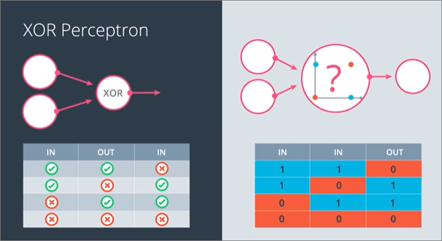

# Summary
1. Classification problems - What are classification problems?
2. Linear boundaries - How we use linear boundaries for classification problems?
3. Higher dimensions - How to incorporate high dimensionality for classification problems?
4. Perceptrons - What are perceptrons?
5. Perceptrons as logical operators - How can these be used as logical operators (e.g. and/or).

## Introduction
- Perceptron = node that accepts **various inputs** and produces **single output**. It is a building block for neural networks
  - inputs can represent many dimensions of dataset (i.e. multiple inputs)
  - inputs are then plotted as a point in a graph to see whether the point is plotted in the positive area.
  - If so, the output is YES, otherwise NO.
    

## Classification Problems
- We can visualize classification problems by plotting points in a graph and segregating using a **line**. This **line** is going to be our model
- Below, we have segregation of students accepted or declined is based upon past data
    
- Model makes a couple of mistakes, but the noise is negligable

## How to fine `line`?
- We use a **linear equation** to define our model and use the **perceptron trick** (described later) to tune our equation/model. 
  - A linear equation - **(i)** An equation that has the highest degree of 1. No variable in a linear equation has an exponent more than 1. **(ii)** a constant variable
- For example below:
  - this linear equation would be our **model**
  - We classify based on result of equation, i.e. **>= 0** or **< 0**
    
  - Terminologies
      1. linear equation notation (w = weight, b = bias)
      2. vector notation (w = weight, b = bias)
      3. y predict legend
      4. y hat formula
      
    

### Higher Dimensions
- Instead of working in 2 dimensions, we work in 3 (if we have 3 parameters)
- Evaluating classification will still be same (in vector notation, i.e. we now have multiple weights and x values):
    - `y_hat = 1 if Wx + b >= 0`
    - `y_hat = 0 if Wx + b < 0`
    

#### N dimensions
- Same as 3 dimensions, instead we visualise as hyperplane
  - Hyperplanes can be used to describe 1D, 2D and 3D, but we typically use hyperplanes only when describing dimensions that we cannot visualize or draw.
    

- Exampel below: each column represents one dimension, so 'price', 'quantity', 'availability', and 'taste' each are represented
    

### Perceptrons
- A perceptron is the building block of neural networks, and it's an encoding of our equation into a small graph.
- Characteristics:
    1. **Input node(s)** - x values and weights, and bias*
    2. **Neuron node** - out equation/graph and boundary line and bias*
    3. **Output** - prediction
    

#### Placement of **bias**
1. Within Neuron, along with equation/model, or
    
2. As a separate node in addition to the x values

However it is common practice to choose the latter version, with the node of the bias having value of 1, and the "weight" of the bias being the bias.
- Example below visualizes perceptron with **n** weights and x inputs
    

#### Set function
- return 1 if **>= 0** and 0 if **< 0**

#### Final visualization of perceptron
- As a sequence of nodes (which **includes the step function too**)

### Perceptrons as Logical operators
#### 3 main types -> AND, OR, NOT
- NOT received 1 input only, i.e. just an inverse of input

#### Multilayer perceptron

- can combine multiple nodes e.g. AND and NOT to create a **NAND** node

#### How do we turn this into a perceptron?
1. First, we turn this table of true, false into a table of zeros and ones, where the one corresponds to true and zero corresponds to false.
2. Next, we draw the perceptron. It has a line defined by weights and bias and it has a positive area which is colored blue and a negative area which is colored red. The perceptron plots each point. If the point falls in the positive area, then it returns a one, and if it falls in the negative area, then it returns a zero.

### Perceptron trick - Finding fit line
- Placing linear equation line randomly by picking random location 
- Find out how badly line is drawn based upon misclassified points. **Get info from misclassified points** which can tell us how much to update the our best fit line.
- Our line can either, move **closer** or **farther**
    

#### Trick
- Use the coordinates of misclassified points to adjust the parameters in the line equation. To keep the adjustments small, the adjustment calculations are multiplied by the Learning Rate. 

- Steps
  1. Starting with coefficients of line
  2. Either minus of plus the **point coordinates * learning rate**
      - minus if **y_hat >= 0**
      - plus if **y_hat < 0**
      - bias = **1 * learning rate**
      - learning rate = hyperparameter value used in calculation that controls how fast/far model adjusts during training. Used to move line closer to points

#### Pseudocode

## TODO
- Understand what's the point of visualizing AND/OR as plots in a graph... as example above...
  - Exercise 7: Perceptron as Logical Operators
- Don't understand why i couldn't get my version of Exercise 9 working...