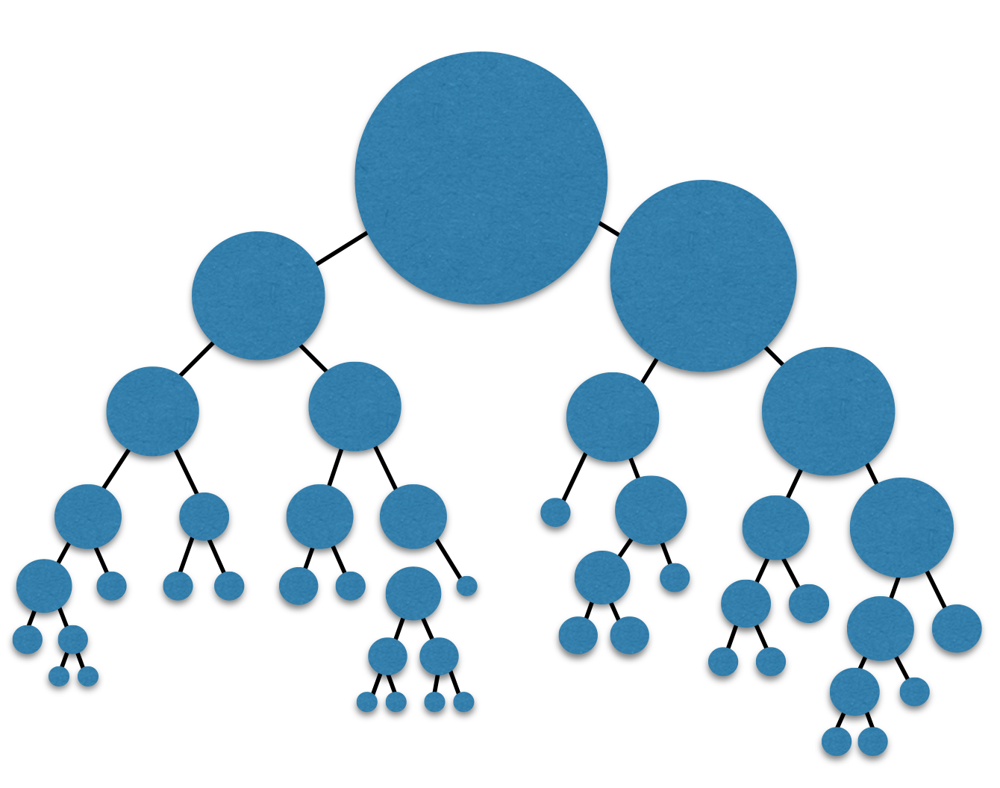
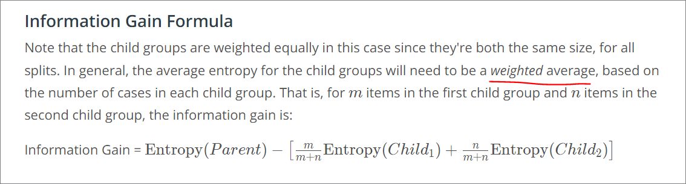

## Summary
1. Recommendation applications
2. Entropy
3. Information gain - How this uses entropy
4. Hyperparameters
5. Decision trees in sklearn

### Characteristics
- Multiple depths
    
- can be Unbalanced
    

### Constructing descision trees
- There may be many **features** available for us to construct descision trees. But we need a way to determine which feature to prioritise and which to avoid. 
- E.g. in the example below, classifying using the **Occupation** feature is betetr than the **Gender** feature, since all that Studies, downloads Pokemon Go as opposed to Gender which is more arbitrary
    
- We first split based upon the feature which provides us the **best value per split**, and then subsequently decide on whether to further segregate
- In example below, we first split by Occupation and subsequently by Gender.
    
- To have this done computationally, we would need measurement criteria for our computer to determine which feature is more **valuable**.
- In ML terms, the purity of nodes are used to determine if a feature is good, 2 methods are:
    1. Entropy
        - uses **log** and is more computationally expensive
    2. Gini Impurity
        - best case = 0, worst case = 0.5, i.e. (50/50)
        - [Builing intuition for Gini](https://www.quora.com/What-is-the-interpretation-and-intuitive-explanation-of-Gini-impurity-in-decision-trees)
- [Difference between Entropy and Gini](https://www.quora.com/Why-is-entropy-used-instead-of-the-Gini-index)

#### Constructing using Continuous features
- Using cross validation, the best value for a continuous feature will be found
- Here is a decision tree constructed from 2 continuous variables

### Entropy
#### Definitions
- Entropy is a **measure of disorder or uncertainty**
1. Physics - How much freedom does a particle have to move around?
    - The entropy of ice is low
    - the entropy of liquid water is medium
    - the entropy of water vapor is high
2. Probabilities / permutations
    - first bucket very rigid - Low
    - can reorganize in 4 ways - medim
    - regorganzie in many ways - high
    
3. Knowledge / likelihood of guessing/winning?
   - The more knowledge one has, the less entropy, and vice versa.
   - Example below
      1. In the first bucket, we know for sure that the ball is red, so we have high knowledge.
      2. In the second bucket, it's very likely to be red and not very likely to be blue. So if we bet that it's red, we'll be right most of the time. So we have medium knowledge of the color of the ball.
      3. In the third bucket, we know much less since it's equally likely to be blue or red. So here, we have low knowledge.
      

#### Formula
1. Computation via probabilities - we can compute the entropy using probability multiplication
    
    - However, there are 2 problems:
    - If we have a thousand balls and take the product of a thousand numbers all between zero and one. This could be a **very very tiny number**.
    - A **small change in one of the factors could drastically alter their product** since it will be multiplied over and over
2. We can turn multiplication to summation with **logarithm**
    - In physics, entropy can be estimated as the **sum of the logs of probabilities** of all states a system can occupy.
    - In machine learning, entropy can be estimated as the **sum of the logs of probabilities** of all labels a dataset has.
    - Log basically scales down the problem with tiny tiny numbers to something that makes more sense
    - References
      - [Odds vs Probabilities, and why use log(Odds)](https://www.youtube.com/watch?v=ARfXDSkQf1Y&ab_channel=StatQuestwithJoshStarmer)
      - [Derivation of entropy formula](https://www.youtube.com/watch?v=YtebGVx-Fxw&ab_channel=StatQuestwithJoshStarmer)
    - Example in logarithm form - we use base 2 for log since typically we only have 2 outputs for classification problems
    
    

#### Formula for Multi variable Entropy
- using p1 and p2 to define probability
- and expanding to pn variables

### Information gain
- Basically Entropy of parent **minus** average entropy of childs (proportioned)
  - i.e. change of entropy

#### Some Gain

#### No gain

#### Max gain

#### Formula
- need to consider weighted average of childs' entropy

### Using entrophy for continuous features
- Formula will test all possible vertical and horizontal cuts and see which one maximizes the entropy
- It then iterates over and over as we build a Decision Tree.
- refer to file `ml-bugs.csv` for calculation of entropy and information gain

### Hyperparameters of decision trees
1. **Max Depth** - largest possible length between the root to a leaf. A tree of maximum length `k` can have at most `2^k` 
k leaves.
    
2. **Min number of samples to split** - If a node has fewer samples than min_samples_split samples, it will not be split, and the splitting process stops.
    
3. **Min number of samples per leaf**
    

#### How hyper parameters lead to under/overfitting

### Code
- As usual
  - initialise `DecisionTreeClassifier`
  - fit
  - predict
- Extras
  - use `accuracy_score` to score model
- Refer to `titanic_survival_exploration.ipynb` for data cleaning etc
  - it test for accuracy on training data **and** test data
  - High training accuracy -> indiication of over training

#### TODO
- learn logarithm arithmetics
- logarithm formulas to calculate entrophy
    - makes sense because essentially dividing by all
- how to make logarithm intuitive?
- entrophy algorithm uses log **base 2**

upper limit increases with the number of different outcomes. (For example, you can verify the maximum entropy is 2 if there are four different possibilities, each with a probability of 0.25.)
- what is max entropy amount for each increment of n?
- 0 is best case

- how to optimise under/overfitting for hyperparameters?

How can classifiers take into consideration of more outputs?