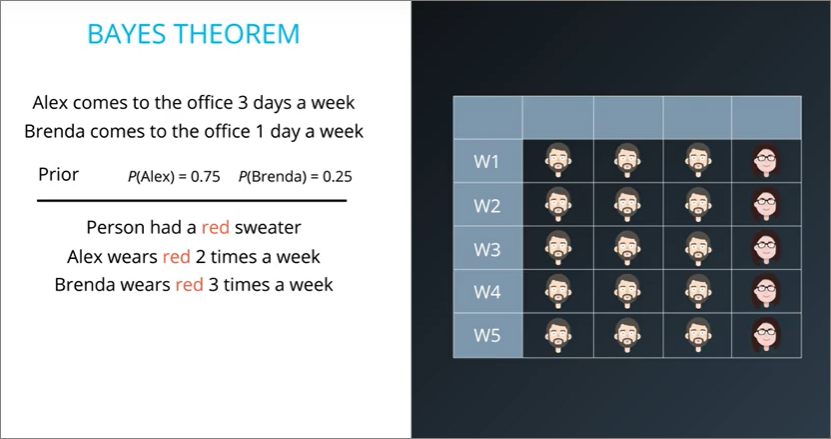
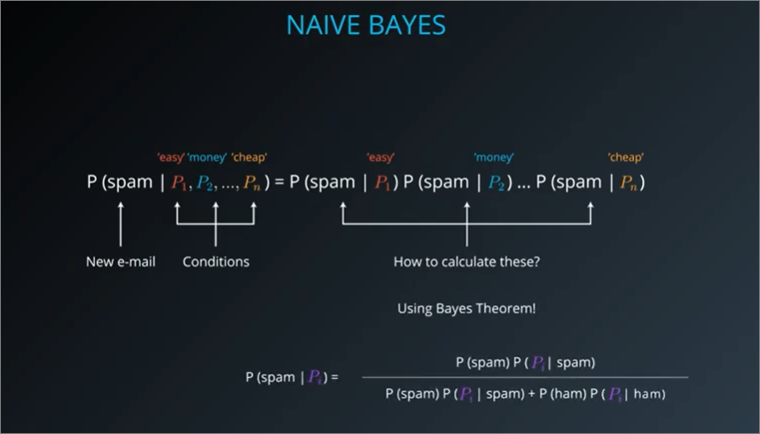

## Summary
- Algorithm that can be trained to classify data into multi-class categories.
- In the heart is a probabilistic model which:
  1. computes conditional probability features
  2. assigns probability distributions to each possible class
- Easy to implement, fast to train
- Good to be used to Natural Language Processing (NLP) tasks, e.g. spam emails

### Outline
- Bayes Theorem
- Bayesian Learning
- Naive Bayes Algorithm
- Building a spam classifier

### Bayes Theorem
#### Prior and posterior probabilities
- Prior - guesses we make/**know** before having complete information
- Posterior - guesses **inferred** after new information has arrived
- In example below, imagine we want to guess person **walking pass hallway**
  - Prior - both individuals pass by equal number of times, i.e. 50/50
  - Posterior - One person wears red sweater more than the other

### [Probability notation](https://stattrek.com/statistics/notation.aspx)
- `P(A)` - probability that event A could occur
- `P(A|B)` - probability that A occurs **given that** B has occured
  - Basically `P(A ∩ B) / P(B)`
- `P(A')` refers to the probability of the **complement** of event A.
  - complement = event A **not occuring**
- `P(A ∩ B)` refers to the probability of the **intersection** of events A and B.
  - Also, `P(A ∩ B)` equals `P(B ∩ A)`

#### Arithmetic
- `P(A|x1,x2,x3) = P(A|x1) * P(A|x2) * P(A|x3)`

#### Statquest
- [Conditional Probabilities](https://www.youtube.com/watch?v=_IgyaD7vOOA&ab_channel=StatQuestwithJoshStarmer)
- [Bayes Theorem](https://www.youtube.com/watch?v=9wCnvr7Xw4E&t=45s&ab_channel=StatQuestwithJoshStarmer)

#### Trefor Bazett
- [Bayes Theorem (simple)](https://www.youtube.com/watch?v=XQoLVl31ZfQ&ab_channel=Dr.TreforBazett)

### 3 Blue 1 Brown
- [Bayes Theorem, geometry of changing beliefs](https://www.youtube.com/watch?v=HZGCoVF3YvM&t=419s&ab_channel=3Blue1Brown)
  - New evidence should not determine our beliefs and values
  - It should **update our prior beliefs**
  - Visualise probabilities in terms of area of grid

### Known vs Infer
- Based on information known, it can **infer other information**
    
- `P(R|A)` = probability that person is `wearing red` **given that** person is `Alex`
  - from above, **wears red** is the probability we're measuring and **Alex** is conditional
- `P(A|R)` = probability that `person is Alex` given that person is `wearing Red`
  - from above **is Alex** is the probability we're measuring and **wearing red** is conditional

### Visualisation of Bayes Theorem
#### Intuition
- Visualisation in probabilities
    
- Note: Ignore the weeks for this
    
- Out of the 4 scenarios, only 2 of them included someone wearing a red sweater, so the other two scenarios are irrelevant
- We need to **normalize** them or equivalently, divide them by something so that they now add to **one**. The thing we should divide them by is the sum of the two.

### Formal version of Bayes Theorem

- `P(A)P(R|A) + P(B)P(R|B)` is commonly written as P(R)

### Exercise 1
- 99% accuracy is **pretty bad**
- We usually only consider false negatives, i.e. 1 out of 100 sick patients are incorrectly diagnosed
- But forget to consider false positives for healthy patients. If the population size for testing is huge, the number of false positives may greatly outweigh the number of true positives
- We usually consider **accuracy** in the perspective of whether a person is sick, but not the magnitude over healthy people are not sick.
  - Accuracy goes **both ways**, incorrectly diagnosing sick and healthy patients 
- Need to visualise that sometimes we cannot always draft a picture like this, and the only information we have is: **1 out of every 10,000 patients is sick** and test has **99% accuracy**

### Exercise 2

- We can easily use Bayes theorem to derive the answer. Finally clicked here why Bayes Theorem is beneficial:
  - We only have limited information, i.e.
    - probability that **money** and **easy** appears in spam/ham, this derives either `P(M|S)`, `P(E|S)`, `P(M|S')`, `P(E|S')` only
    - However, Naive Bayes requires us to derive probability of `S` or `S'` given something. Bayes Theorem allows us to flip from the 4 scenarios above to one finding the probability of S\S', i.e. `P(S|x)`, `P(S'|x)`, with x being a prior probability

### Assumptions
- We assume all our probabilities are independent
  - E.g. emails containing the word `easy` is more likely to contain the word `money`. This is a Naive assumption because it could be that these two are not independent. It could be that emails containing the word easy are more likely to contain the word money. But it turns out that this assumption ends up working really **well in many situations**.
  - E.g. 2 features, for detecting diabetes. **(i)** The individual exercises less than or equal to 2 days a week **(ii)** individual exercises greater than or equal to 3 days a week. Both are clearly not independent
- No occurence of false positives

### Bayes Theorem with multiple conditions (or features in ML sense)
- In relation to bayes theorem, we would need to calculate each of the conditions/features **x** with Bayes Theorem.
    
- Example of multiple conditions
    

### Terminologies
1. Probability vs conditional probability
    - Probability looks at the likelihood of one event occurring. Conditional probability looks at two events occurring in relation to one another. It looks at the probability of a second event occurring based on the probability of the first event occurring.

### Code
1. `read_csv` vs `read_table`
2. Step 1.2 - convert categorical labels to numerical values using `Series.map`
3. Tokenize words using count vectorizer
   1. converts all to lower case by default
   2. regex to not consider special characters, e.g. hello and hello! are the same
   3. stop words to ignore all common english words
4. `Counter` method from `collections`
5. Using `pprint` to print dictionaries
   1. `pprint.pprint`
6. printing python Class to view parameters required to be inputted
7. `CountVectorizer`
   1. [Why do i actually need to fit this data?](https://stackoverflow.com/questions/54973289/what-is-the-significance-of-fit-in-countvectorizer#:~:text=1%20Answer&text=As%20stated%20by%20the%20documentation,position%20in%20the%20output%20matrix.)
    - As stated by the documentation, the fit method "learn(s) a vocabulary dictionary of all tokens in the raw documents", i.e. it creates a dictionary of tokens (by default the tokens are words separated by spaces and punctuation) that maps each single token to a position in the output matrix.
   - Transforming data turns this to index numbers
8. Revisit diabetes question
   1. `P(Pos) = [P(D) * Sensitivity] + [P(~D) * (1-Specificity))]`
   2. this makes sense just afriad ill forget about it
   3. `P(D|Pos) = (P(D) * Sensitivity)) / P(Pos)`
      1. second question is basically naive bayes formula, but it uses `P(Pos)` from earlier question
9. `Multinomial Naive Bayes`
   1.  suitable for classification with discrete features
10. `Gaussian Naive Bayes` is better suited for continuous data as it assumes that the input data has a Gaussian (normal) distribution.
11. Evaluation terminologies
    1.  Accuracy (not the best, because we may mix up false positives)
    2.  Precision
    3.  Recall (sensitivity)
    4.  `F1 score`, which is the weighted average of the precision and recall scores
    5.  [Statquest sensitivity and specificity](https://www.youtube.com/watch?v=vP06aMoz4v8&ab_channel=StatQuestwithJoshStarmer)
        1.  to learn precision
        2.  `Accuracy, Precision, Recall or F1_ _ by Koo Ping Shung _ Towards Data Science.pdf`

### Conclusion
1. One of the major advantages that Naive Bayes has over other classification algorithms is its ability to handle an extremely large number of features.
2. It performs well even with the presence of irrelevant features and is relatively unaffected by them. It has is its relative simplicity.
3. It works well right out of the box and tuning its parameters is rarely ever necessary, except usually in cases where the distribution of the data is known.
4. It rarely ever overfits the data.
5. Its model training and prediction times are very fast for the amount of data it can handle.

## TODO
- statquest Bayes theorem
- Probability notations
  - **|**
  - complements, c
  - U
- Build intuition over notations
- Watch Lesson 5 Bayes Theorem again
- Watch and write notes for Lesson 11 and 12
  - It seems intuitive and i can understand it but the notations just catch me off guard.
- 14 is good also