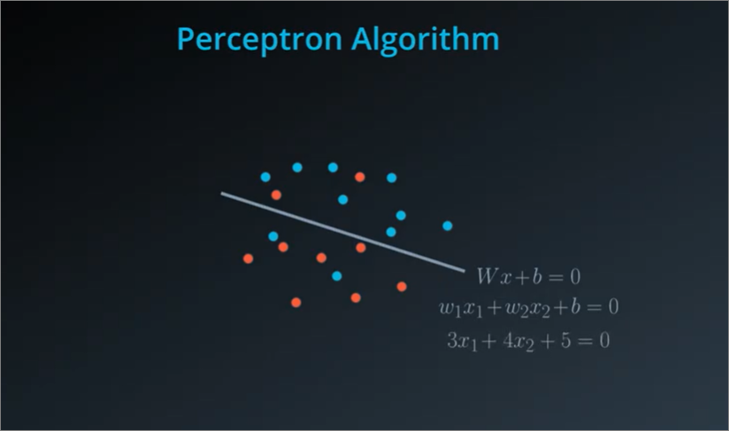
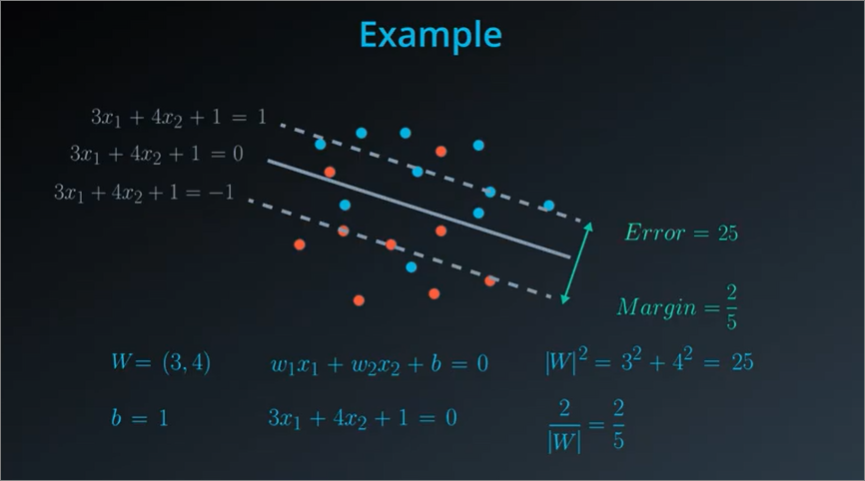
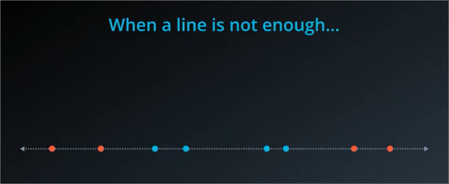

## Summary
- Support Vector Machines (SVMs) are used for:
  - **Classification**
  - Finding Best Boundary
- Fitting model by:
    1. **Splitting** data with a Line
    2. **Adds margins** to model to improve accuracy of training model

### Overview
1. Minimizing distances
2. Error functions and the use of the **Preceptron algorithm**
3. The C parameter
4. Polynomial Kernal
5. RBF Kernal
6. SVMs in sklearn

### Objective
1. Train a Support Vector Machine to separate data linearly
2. Use Kernel Methods in order to train SVMs on data that is not linearly separable

### Finding line to fit
1. Example
    - yellow line is pretty well-spaced between the blue points and the red points
    
    - SVM looks at distance between closest points to line(s). The longest **"shortest distance to the line"** is the better model.
    

### Error function
- **Similar** to purpose of error function (i.e. MAE/MSE) in **Linear Regression**
  - it is used to measure total error of a line placed
- Simple criteria to **measure error** for a model is by using margin, i.e. the larger the space between line and shortest distance to line, the better the model.
    
- Say we have a more realistic plot where a line is marked, in addition to consider margin, we also consider number of point misclassifications
- Hence, `Error function for SVM = Classification Error + Margin Error`. Goal is to minimise sum of both of these errors
    

### Perceptron Algorithm for computation of error
#### **Logic**
        Sum of the distances of these misclassified points to the boundary.

#### Steps
1. Splits line
    
2. Visualise splitting to multiple plots and visualise linear equation to calculate distance from boundary
3. Punishes points which are further from boundary by considering **absolute values** since there are points **above and below** the boundary line
    
6. Combine total errors in all plots. This error function would be used with gradient descent to find ideal **W**eight and **b**iases which give us the best cut. 
    

### Classification error
1. Very similar to Perceptron Algorithm, but includes incorporation of **margins**. Since we expect that no items should be present within the margin, anything in the margin is considered a classification error **aswell**
    
2. Instead of measuring distance from boundary, we measure from the **closer margin** to each respective side, and consider misclassifications within the additional margin space
    
3. **SVM Classification Error** computation - Combining both absolute errors
    

### Margin error
#### Intuition
Margin and Error is inversely related

#### Quantifying margin and error
- Margin is `2 / norm of W (|W|)`, 
- norm of W = square root of sum of squares of W
- Since W appears here in the denominator, then a large margin gives us a small error and a small margin gives us a large error. That is exactly what we wanted.

- We have our large margin, our margin of 2/5 that gives us a small error of 25, and our small margin of 2/10, which is 1/5 gives us a larger error of 100.
- In conclusion, margin error is basically `|W|^2`
- exact same error that is given by the regularization term in **L2 regularization** (from linear regression).

### **SVM** Error function

### C Parameter
- If both of lines below have been fit, which is the better line?
- No direct answer and it will depend on our use case, e.g:
  - If high precision (**low classification errors**) is required, model at right will be chosen, e.g. a Medical model
  - If we prefer a well spaced boundary, while giving some precision/classification
  

#### Introduction
    The C parameter is just a constant that attaches itself to the classification error by multiplying the classification error by the constant.

- **The C parameter** - also referred to as the C hyper-parameter - determines how flexible we are willing to be with the points that fall on the wrong side of our dividing boundary. The value of C ranges between 0 and infinity. When C is large, you are forcing your boundary to have fewer errors than when it is a small value.
- We usually use **Grid Search** to tune the hyperparameter
- **Note**: when C is too large for a particular set of data, you might not get convergence at all because your data cannot be separated with the small number of errors allotted with such a large value of C.

#### Cheat sheet
- If we have a **very large C**, then the error is mostly the classification error, so we're focusing more on correctly classifying our points than on finding a good margin.
- If the C is **very small**, then the error is mostly a margin error, so we're focusing mostly on a large margin than on classifying the points correctly.

### Polynomial Kernel
#### When to use?
- When points cannot be divided by a straight line

#### Problem
- We see that there isn't a clear line to split the points in the line below
    
- We can instead convert the line into a plane, by **squaring** the x values and lifting the points to its place in the parabola. (i.e. converting a 1-dimensional problem to a 2-dimensional problem)
- Our points are easily separable now, and we can use the original **SVM algorithm for 2D** to find a good cut
    
- We use the intersection of the lines, i.e. `x=-2` and `x=2` to plot the boundarie**s** on the line
    
- This is the **Kernel Trick**
    

### Kernel trick in higher dimensions
#### Methods
- Circle Method
  - Draw circle in 2D
  - circle method **sacrifices the linearity**, and instead of using a linear equation, **uses a higher degree polynomial equation**.
- Builiding Method
  - Think in a higher plane, e.g. 2D think as 3D
  - **sacrifices the dimensionality of the data**, and now you don't have data in two dimensions, instead, you have it in three dimensions. You **still have linear boundaries** with this method.
  - Think outside the plane in higher dimensions by introducing a z-axis. We can think that we're living in a building, and we send the blue points to the 2nd floor of the building and the red points to the 18th floor. We separate the points by putting a boundary on the tenth floor. The 2 and 18 are **not arbitrary**.
- Same method
  - Both the circle and building method are the **same methods**, i.e. the **kernel method**

#### From 2D to 3D

### RBF (Radial Basis Functions) Kernel
#### High level intuition
- Imagine drawing a mountain (i.e. a function) on each point
- Raise or decrease (+1 / -1) points depending on classification labels
- Combine functions of all of the updated mountains of the points
- **Does this mean that if data has 10000 data points, there would be 10000 variables or mountains?**

#### Gamma hyperparameter
- Gamma high > sigma large > curve narrow
- Gamma low > sigma small > curve wide

### Code
- `class sklearn.svm.SVC`
#### Parameters
- `C` - c classifier parameter, default 1.0
- `kernel` - 'linear’, ‘poly’, ‘rbf’, ‘sigmoid’, ‘precomputed', default rbf
- `degree` - for polynomial, default 3
- `gamma` - for rbf, default `1 / (n_features * X.var())` 

## TODO
- what does this have to do with perceptron for calculating error?
- Norm of vector
- Revisit Lesson 9