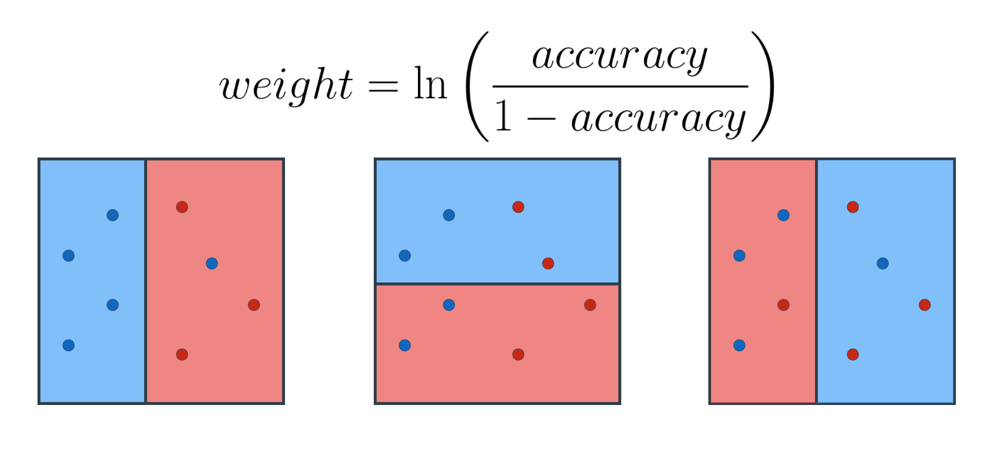

## Summary
- Ensample methods -> joining existing models (weak learners) to create an even better model (strong learner)

### Objectives???
1. Build data visualizations for quantitative and categorical data
2. Create pie, bar, line, scatter, histogram, and boxplot charts
3. Build professional presentations

### Overview
1. Ensembles
2. Random forests
3. Bagging: bootstrapping and aggregating
4. Boosting: AdaBoost
5. Weighting the models
6. Combining the models
7. AdaBoost in sklearn

### Terminologies
1. Weak learners
2. Strong learner
3. Strategies involved -> **bagging** (Boostrap aggregating) & **boosting**

#### Bagging (Bootstrap aggregating)
- Let's say we have an exam, bagging would involve choosing the answer which is **chosen most** among all our weak learners
- The model which considers all weak learners would be our **strong learner**

#### Boosting
- Intead of choosing among learners, we can have each weak learner be **specialised** to answer a specific type of question. 
- All weak learners would be combined to become our **strong learner**

#### Weak learner
- Commonly the **"weak" learners** we use are decision trees. In fact, the default for most ensemble methods is a decision tree in sklearn.

### Ensambles
#### Why want to ensamble learners together?
- There are two competing variables in finding a well-fitting machine learning model:
1. Bias
    - When a model has a high bias, this means that means it **doesn't do a good job of bending to the data**.
    - **Linear regression** usually has high bias
    - We can arrive at the same line to fit the data even with different datasets
        
2. Variance.
    - When a model has high variance, this means that it **changes drastically to meet the needs of every point in our dataset**. / **very flexible to fit exactly whatever data it sees**
    - The linear regression model above has low variance
    - **Decision trees** tend to have high variance and low bias (especially decision trees with <ins>no early stopping parameters</ins>). It will attempt to split every point to its own branch if possible

#### How to have ideal bias or variance
- By combining algorithms, we build models which **meet in the middle** in terms of bias and variance
1. Mathematical theories based on minimizing bias and variance, like the central limit theorem.
2. **Introducing randomness** into high variance algorithms before they are ensambled together
    - combats tendency for model to overfit
    - 2 ways:
      - **Bootstrap the data** - that is, sampling the data with replacement and fitting your algorithm to the sampled data.
      - **Subset the features** - in each split of a decision tree or with each algorithm used in an ensemble, only a subset of the total possible features are used.

### Random Forests
- Decision trees tend to overfit and doesn't generalise well, i.e it just memorised the data
- **E.g.** in terms of continuous data:

#### How it works
- some features picked **randomly** from data
- decision tree is built on those features
- repeat and build a few more decision trees
- Have all trees make prediction and pick prediction that appears the most

#### Another visualisation
1. Partitioning data
    - we pick fully random subset of data
    - allowed to repeat points, and not consider some points at all
2. Overlay each weak learner, in this simple example, since there are 3 weak learners, if 2 or more of them pick 1 color (e.g. blue), then that region is that color
    
3. Can consider a way to break ties if there are even number of models

### AdaBoost
#### Objective
- Minimise amount of errors

#### Formula
- accuracy / (1 - accuracy) is basically right / wrong

#### [StatQuest](https://www.youtube.com/watch?v=LsK-xG1cLYA&t=60s&ab_channel=StatQuestwithJoshStarmer)
- In AdaBoost, if used with random forest, the trees usually has one node and two leaves. 
  - A tree with one node and two leaves - **Stump**
  - So we would have a forest of **Stumps**

### Code
- `sklearn.ensemble.AdaBoostClassifier`
- hyperparameters:
  - `base_estimator` - model used for weak learners
    - !! **Need to import** model for weak learner
  - `n_estimators` - max number of weak learners used
- Exercise doesn't use `base_estimator`?
- Need to get more clarify over Accuracy, Precision, Recall and F1
  - Precision = true positives / predicted positives -> want to emphasis over no false positives
    - e.g. email spam detection, false positives are bad since email will be deleted
    - no spam -> yes spam
  - recall = true positives / actual positives -> emphasis over false negatives, e.g. fraudulent transcation predicted as non-fraudulent
    - yes fraud -> no fraud
- From exercise, since we are dealing with spam detection, precision seems to be the most important metric, as even 99% imprecision would lead to 1 out of 100 emails discarded as spam...?

## TODO
- understanding introducing randomness better
- Exercise 5 to 10 sort of explains the same thing
- understanding boostrapping data (i.e. sampling data with replacement?) and subset of features better...
- gain intuition over how it reduces variances and avoids overfitting
- gain intuition over bias and variance
- read further readings