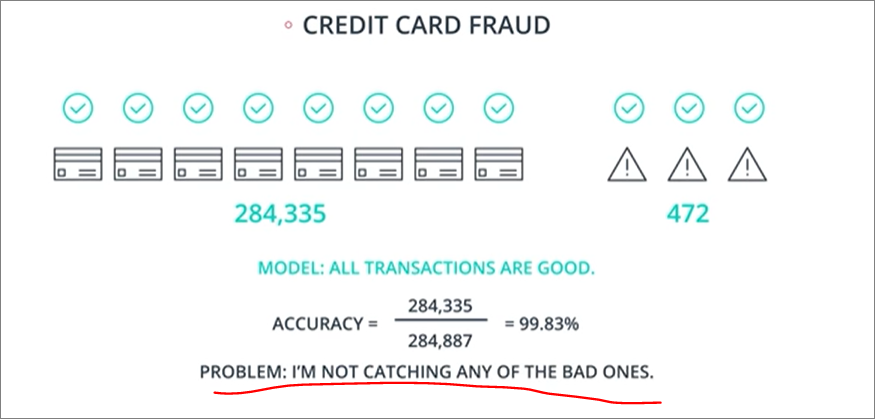

## Summary
### To learn
1. **How well** is my model doing? To learn metrics
2. How do we **improve it** based on these metrics?

### Outline
- Testing your models
- Confusion matrix
- Accuracy
- When accuracy won't work
- False negatives and positives
- Precision and recall
- F1 score
- F-beta score
- ROC curve
- Classification in sklearn
- Regression in sklearn

### Revisiting importance of generalisation and overfitting
- If model doesn't generalise well, it tends to overfit

### Testing data
- Never use testing data as training data
#### Code
- use `sklearn.model_selection.train_test_split`
  - For data of size 16, set test size, e.g. test size of 0.25 would have 4 test and 12 training data 

### Confusion Matrix

#### True positives, True negatives, False positives, False negatives
- Are these mainly for classification problems only?

#### Error Types
1. Type 1 - False positive
    - misdiagnose healthy patient as sick
2. Type 2 - False negative
    - misdiagnose sick patient as healthy

### Accuracy
- `True positive + True negative / all data`
- Model with high accuracy (basically memorising training data)
  - May **overfit**
  - **Not generalise well** to new data

#### Code
- `accuracy_score` function

#### Answer
1. Medical - `(1000 + 8000) / 10000 = 90%`
2. Spam - `(100 + 700) / 1000 = 80%`
3. Graph - `(6 + 5) / 14 = 78.57%`

#### When acuracy bad (by visualising using credit card fraud)
- May be terrible metric if data is very skewed
- Imagine using a model where **all transactions are predicted to be good**
- In example below, there is a very high accuracy, but still completely **fails to detect any bad credit card transactions**, which totally fails to address the problem at hand
    

### False Negatives and Positives
Instead of using accuracy, we can first focus our attention on which of the following are more important:
1. False positives
    - In our medical matrix, **False Negative** implies sending a sick person home, which can be disastrous
2. False negatives
    - In our spam matrix, **False Positive** implies missing an e-mail from your dear grandma, which can be disastrous

### Precision
- `True Positives / Positive Predictions`
  - positive predictions = true + false positives
- So **false positives** matter more
  - more important in spam detection than medical diagnoses

#### Asnwer
1. Medical - `1000 / (1000 + 800) = 55.55%`
2. Spam - `100 / (100 + 30) = 76.92%`
3. Graph - `6 / (6 + 2) = 75%`

### Recall (**Specificity**)
- `True Positives / Actual Positives`
  - acual positives = true positives + false negatives
- So **false negatives** matter more
  - more important in medical diagnoses than spam detection

#### Answer
1. Medical - `1000 / (1000 + 200) = 83.33%`
2. Spam - `100 / (100 + 170) = 37%`
3. Graph - `6 / (6 + 1) = 6/7`

### F1 Score
- If we want **One Score** out of precision and recall

#### Why cannot use **mean** to combine precisiom and recall?
1. Still doesn't really explain model well (same problem as using accuracy)
    
- Using example earlier of labelling all credit card frauds as positive. This still dones't make sense
    

#### Formula
- Essentially the **harmonic mean** of precision and recall
- The harmonic mean will always be less than the average, and closer to the lower value of precision and recall
    
- Going back to credit card fraud, this now makes more sense showing a score of 0%
    

#### Answer
1. Graph - 66.66%

### F-beta score
- Incorporate hyperparameter to swing F1 to precision or recall, e.g. F0.5 or F2 score
- Not direct, finding good beta requires intuition and understanding of data, as well as experimentation

#### Formula
- beta < 1 swings to precision
- beta > 1 swings to recall

#### Examples
1. Detecting malfunctioning parts in spaceship
    - emphasis over false negatives
      - cannot have malfunctioning parts
    - High recall model, and beta > 1
2. Sending phone notifications about videos a user may like
    - low implication over false positives or false negatives
    - can have standard beta of 1
3. Sending promotional material in mail to potential clients
    - risk of over-sending due to false positives of potential cients
    - High precision model, and beta < 1

#### F beta boundaries

### ROC Curve

## Choosing metrics
- choosing metrics (accuracy, precision, recall, F1) depends on use case
  - refer to medium article in 5_naivebayes.

### Exercise
- Exercise 15
  - What is Bag Classifier?
  - Have a look at ROC AUC?
    - Why need to use ROC?

## Regression model metrics
### Mean absolute Error
- `sklearn.metrics.mean_absolute_error`
- Problem with mean absolute error is that it is not differentiable at minimum
- [Absolute value wikipedia](https://en.wikipedia.org/wiki/Absolute_value)
- [Why MAE not differentiable](https://www.youtube.com/watch?v=VpEZKqhwbF8)

### Mean squared error
- `sklearn.metrics.mean_squared_error`

### R2 score
- `sklearn.metrics.r2_score`
- Comparing our model with **the simplest/most basic model**
  - This would be basically drawing a line through the average of all points
- `R2 = 1 - (Our model - Simplest model)`

### Exercise 18
#### Models that can be used for regression/classification
1. Both - Decision tree, Random Forest, AdaBoost
2. Classification - Logistic Regression
   1. This is widely used for regression takss
3. Regression - Linear Regression
- However, technically sklearn won't stop you from doing most of anything you want, i.e. using linear regression for classification

### Summarising Machine Learning

## TODO
- True positives, True negatives, False positives, False negatives
  - Are these mainly for classification problems only?
- ROC curve
- Revisit Lessons 14 to 16
- Watch statquest
  - R2 score
  - Logistic regression - why only for classification