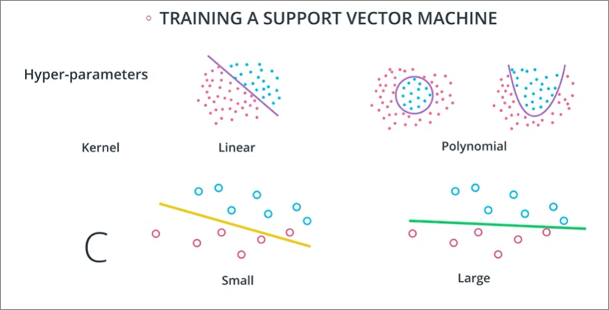

## Summary
### Outline
- Types of errors
- Model complexity graph
- Cross validation
- Learning curves
- Grid search
- Grid search in sklearn
- Putting it all together

### Machine learning flow

### Types of Errors
1. Underfitting
    - **oversimplify** problem
    - Does not do well on training set
    - Error due to **bias**
    - 
    
    

2. Overfitting
    - **overcomplicate** problem
    - Does well in training set, but tends to **memorise** it instead of learning characteristics of it
    - Error due to **variance**
    
    

- Tradeoffs

#### Reference
- [Statquest](https://www.youtube.com/watch?v=EuBBz3bI-aA&ab_channel=StatQuestwithJoshStarmer)
  - **Bias** - inability for machine learning method to capture true relationship between variables
    - In the case of linear regression, the line is 'biased' to be straight. However it will have relatively low variance because the Mean squared error of predictions are pretty **consistent**. It may make good predictions consistently, but not great predictions. 
  - **Variance** - high variances (e.g. MSE) between predictions against model. I.e. not consistent predictions
  - Common methods to find sweet spot between simple and complicated models:
        1. Reguralization
        2. Boosting
        3. Bagging

### Model Complexity and Cross validation
#### Visualisation

1. Linear model - 3 training error/ 3 testing error
2. Quadratic model - 1 training error / 1 testing error
3. Polynomial model - 0 training error/ 2 testing error

#### Model Complexity Graph
- However, using the graph below is **inappropriate since we are using our testing data for training** 

- Instead we add a Cross-validation set in our split:
  - **Training** -> used for training parameters / fitting model
  - **Cross-validation** -> used for making decisions about model (e.g. degree of polynomial etc)
  - **Testing** - Final testing of model

- Updated complexity graph (exchanging testing data with cross validation data)
    

### K-fold cross validation
- Splitting our data as above may not be the best since we're throwing away training data (for cross validation purposes) which may be useful...
- K-buckets split up the data into K smaller chunks, then training occurs using each bucket, then all those training results are averaged together.
- E.g. If we have 4 buckets, this would be called 4-Fold Cross Validation

#### [Benefits and use of cross validation](https://www.youtube.com/watch?v=fSytzGwwBVw&ab_channel=StatQuestwithJoshStarmer)
- (from above) -> to guess a **tuning parameter** to be used in our model, e.g polynomial degree in linear regression, e.g. above
- **Reduce random chance** of choosing favourable/unfavourable train/test data since we would be averaging out results of our model.

#### What is it
- Breaking our data into buckets (e.g. 4 buckets)
- And train our model K times, (e.g. 4 times)
- Result of model is averaged

#### Code
- Initialising `KFold` object (with size of training set & testing set)
- Randomising

### Learning Curve
- Convergence of training error and cross-validation (testing) errors
- Visualising with graph where, x = **training data used**. If more training data used, there likely is going to be convergence
  - **High Bias** = converge at lower point
  - **High Variance** = lines don't converge

#### **High Bias**
- Bad training result (higher error)
- Bad testing (cross-val) result

#### **High Bias**
- Good training result
- Good testing (cross-val) result

#### **High Variance**
- Good training result (lower error)
- Bad testing (cross-val) result (high error)

#### Summary

### Grid Search
#### Recap (Only 1 hyperparameter)
- Using decision tree as our model
  - we fit 4 models of depth 1 to 4 using **training data**
  - we then calculate f1 score using **cross validation data**
  - finally test result of our model using our **testing data**

#### What if we have 2 or more hyperparameters?
- Say we have many parameters for SVM

1. We make a table of all possibilities 
2. Calculate f1 for each possibility with cross val
3. Test with training

Question: how do we scale continuous hyperparameters? e.g. **C**?
In our example since our rows are the different values of gamma. It's recommended to take a few values that grow exponentially such as 0.1, 1, 10,100,1000.

#### Code
- refer 'grid_search_insklearn.pdf`

## TODO
- Gain intuition over cross validation
- Gain intuition over how k-fold cross validation addresses problems from normal cross validation
  - What is a K-bucket?
- K fold cross validation - how would this work with grid search?
  - since kfold splits train/test to buckets, and
  - grid needs train/crossval and test sets?
- For code
  - Revisit Exercise 7 over how learning curve is graphed
  - Need to flip the curve
  - How do they visualise by putting a boundary around classified points?
- Refer `Learning curve visualization.pdf`
- Revisit Exercise 11/12
  - How to gain intuition over hyperparameters to be tested?
  - Why finer step sizes impact the result?
- Exercise 13
  - What is `RandomizedSearchCV`?
  - Course doesn't cover:
    - exploratory data analysis, 
    - feature engineering, 
    - data cleaning, 
    - and data wrangling.
- In practice, randomized searches across hyperparameters have shown to be more time confusing, while still optimizing quite well. One article related to this topic is available here. The documentation for using randomized search in sklearn can be found here and here.
  - Comparing [randomized search and grid search](https://scikit-learn.org/stable/auto_examples/model_selection/plot_randomized_search.html#sphx-glr-auto-examples-model-selection-plot-randomized-search-py)
- Tuning parameters - make sure to be aware of the value ranges - https://towardsdatascience.com/hyperparameter-tuning-for-support-vector-machines-c-and-gamma-parameters-6a5097416167, e.g.
    - 0.0001 < gamma < 10
    - 0.1 < c < 100

