### Overview
1. Learn the basics of clustering data
2. Cluster data with the K-means algorithm

#### Use-cases of K-Means
- Cluster similar books and articles
- Cluster similar Music, movies - to build recommendation clusters in netflix or spotify
- Cluster similar groups of customers / students - so better teaching strategies can be employed

## K-means
### Visualising in 2 dimensions
- '**k**' represents the number of clusters you have in your dataset
- In example below, k value is 2
- **blue** represents travelling to work, and **red** represents visiting families
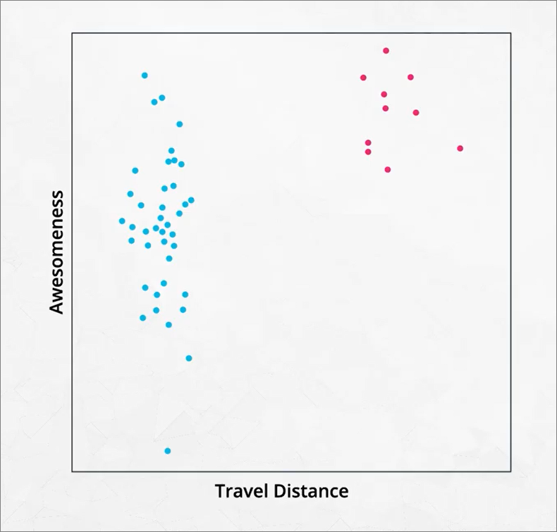

### Visualising in 3
- We can also view in 3-dimensions, but the angle of perspective matters
- refer to `Identifying_Clusters.ipynb`

### K parameter - How to change k value?
- What is a good k value?
- In this example 3 is clearly appropriate visually
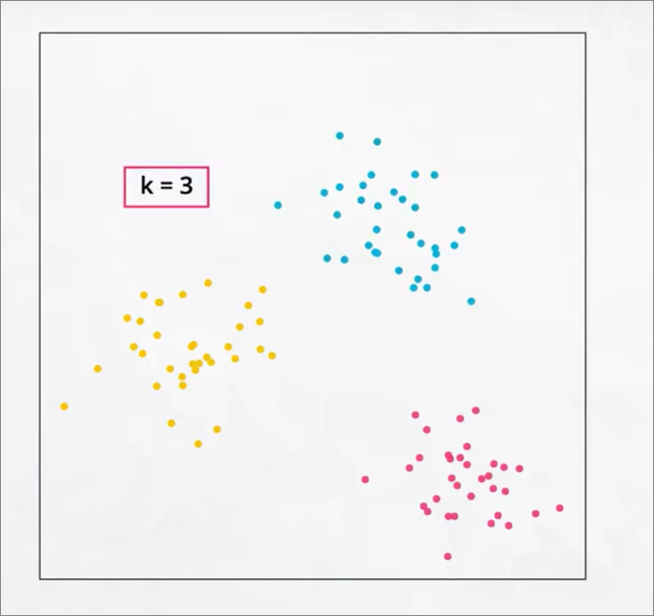

- In this example 2 is clearly better than 3
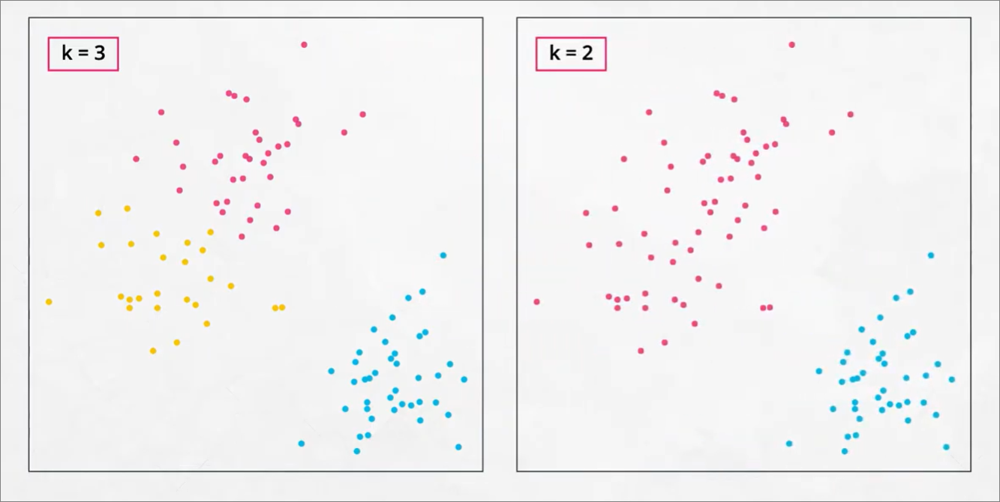

- But, If we have **large observations** and **large features (dimensions)**, how to choose k?
  - It's a balance of art and science
- We can choose k based on **prior knowledge** / **preconceived ideas**
  - E.g. udacity groups students to
    - 1. Students new to field
    - 2. Students wanting to skill up in their existing careers
    - 3. Students wanting to change careers
  - So, **k can be 3**
- If no prior knowledge, we can use **decision methods instead**, since sometimes, we don't have necessary prior knowledge to identify number of clusters in our dataset

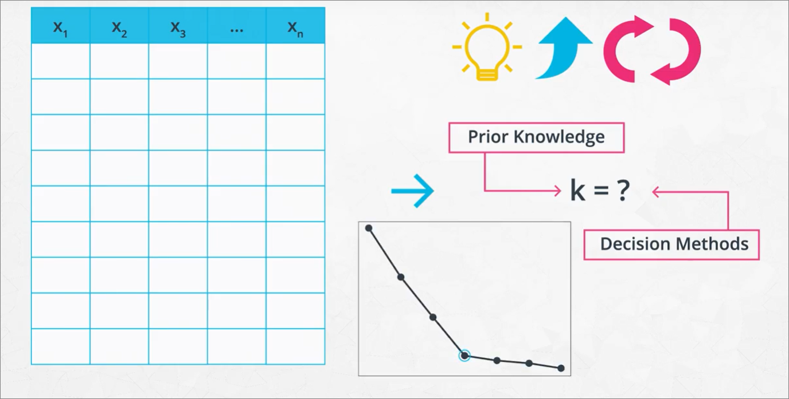

### Decision methods -> elbow method
#### Steps
1. Define number of clusters, e.g. 3, 4
2. Randomly plot center of clusters and then measure average distance of points in the cluster to the center of each cluster.

#### Observation
-  Each time k increases (additional centers are considered), the distances between the points and the center will decrease. 
- However, at some point, that decrease is not substantial enough to suggest the need for an additional cluster.

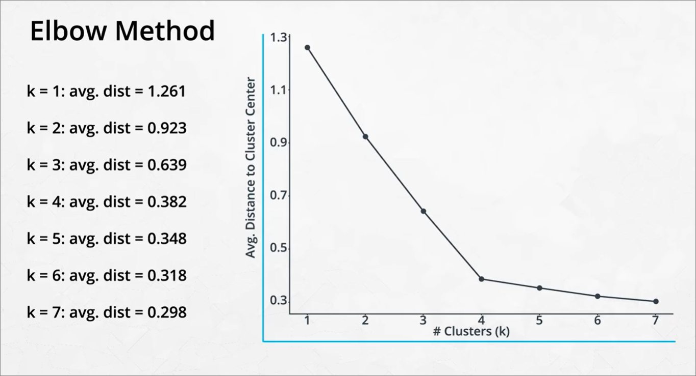

- increases in smaller k result in **large decreases**
- increases in larger k result in **smaller decreases**

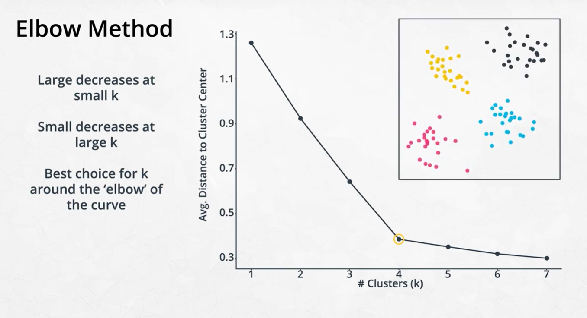

#### Judgement call
- Finding optimal amount of K is sometimes a **judgement call**

#### [Scree plot](https://www.google.com/search?q=scree+plot&sxsrf=AOaemvIPL4xeEMx0vstGWFYCEUk7JI4fQg:1642148833104&source=lnms&tbm=isch&sa=X&sqi=2&ved=2ahUKEwjXx_WO6bD1AhUZqZUCHU3sAwEQ_AUoAXoECAIQAw&biw=1396&bih=691&dpr=1.38)
- Using a scree plot is a common method for understanding if an additional cluster center is needed. The elbow method used by looking at a scree plot is still pretty subjective, but let's take a look to see how many cluster centers might be indicated.

- refer notebook `Changing K.ipynb`

### Code
1. Import from `sklearn.cluster.KMeans`
2. Initialise kmeans - `model = KMeans(4)` for **4 centroids**
3. Fit model - `model.fit(data)`, data is just X, no need y since unsupervised learning doesn't have labels
4. Predict - `model.predict(data)`

#### Others
- We can use `model.score` to create a **Scree plot**
  - Score returns negative value, so need to use `abs()` against it

### How does K means work?
#### Steps
1. **Centroids (Cluster centers)** are randomly assigned on grid
2. **Points** are assigned to the closest centroid
3. Centroid is then moved to the center to the cluster
4. Points are **assigned again** so that they now relate to the closest centroid
5. Steps 3 and 4 is repeated until no further movements are detected in each cluster. This means that there can be alot of minimal movements until the centroids are fixed

#### [Calculating distance between points](https://www.youtube.com/watch?v=4b5d3muPQmA&ab_channel=StatQuestwithJoshStarmer)
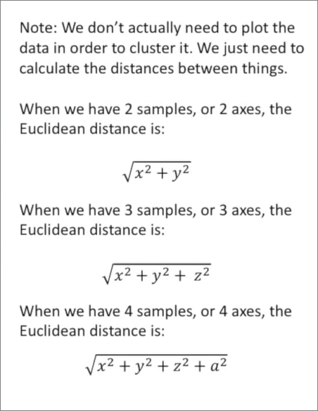

#### References
1. [Visualiser of K-means](https://www.naftaliharris.com/blog/visualizing-k-means-clustering/)
2. [Coding K-means](https://mubaris.com/posts/kmeans-clustering/)

#### Important Considerations
1. So, do starting points of each centroid matter? - **Yes**
2. Grouping of clusters may not always be the same
    - How do we choose optimal centroid placement? By **running k-means algorithm multiple times**, i.e. using **repeated runs** to protect against **local minima**
    - Scikit learn does it for us by using starting points which are substantially different from each other

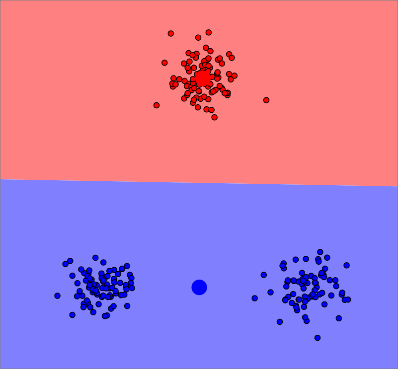
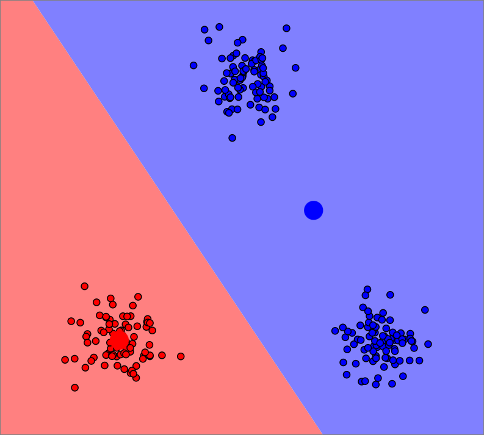

Best grouping is determined when the average distance from centroid to points is the smallest in repeated runs

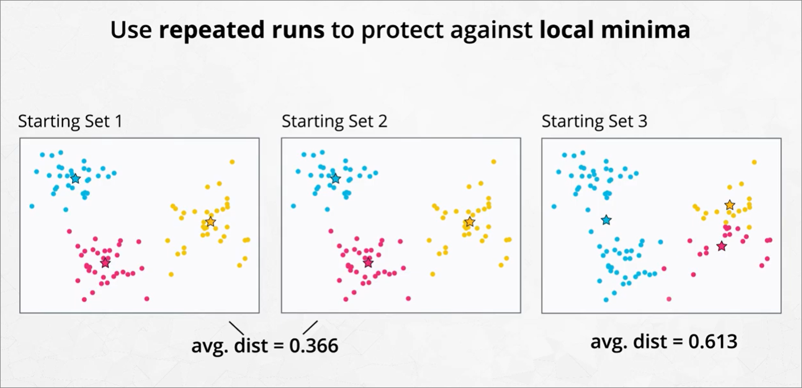

#### Quiz
1. Even with the same number of centroids, you can end up with different groupings of your dataset depending on the starting points of your centroids.
2.  For each additional centroid, it is **not possible for the average distance to increase**. However, **at some point this distance will level off** (this point is called the elbow), and it won't be necessary to add additional centroids.
3. There are a number of methods to choose optimal k. The best method for one situation might be different than for another. Choosing k is a bit of an art and a science. Sometimes you can see it, sometimes it is pre-determined, and sometimes you might use a scree plot.

### Importance of feature scaling for K-means
- Previous use of feature scaling -> Lasso/Ridge Regression
- K-means uses distance in its algorithm
- So scaling is required
  - **Normalizing or Min-Max Scaling** - this type of scaling transforms variable values to between 0 and 1.
  - **Standardizing or Z-Score Scaling** - this type of scaling transforms variable values so they have a mean of 0 and standard deviation of 1.
  - In most cases, we just use standardised scaling
- Features with **larger variance** will **dominate importance**

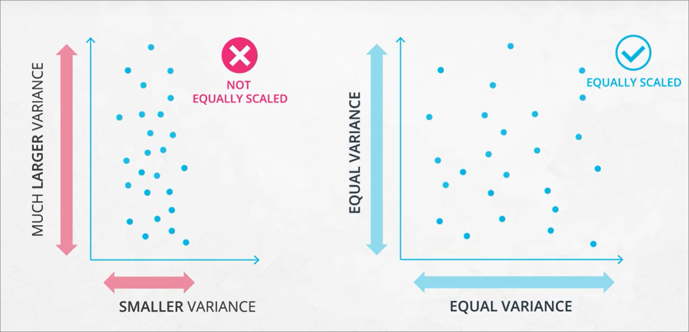

#### What happens if scaling not performed
- Here, depending on the scaling of the features in the dataset, we ended up with 2 completely different clusters.
- Standardizing your data (both features in the above case), would assure that we get consistent clustering of our data each time. 
- Manipulating the clusters created by adjusting the feature scalings for either feature is cheating (or likely to provide misleading results)
  
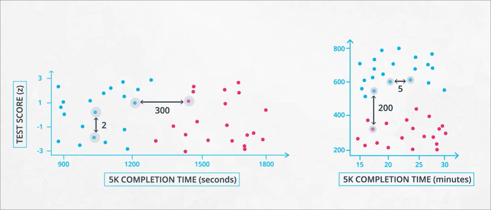

#### Code
- `Feature Scaling Example.ipynb`
- `Feature Scaling.ipynb`
  - recap: `StandardScaler` - mean of 0 and std div of 1
  - `MinMaxScaler` - numbers are in range, defaulted to 0 to 1

## Questions
1. Why can dataset with 5 dimensions translate to 3 visually?
    - 5 features are used for KMeans algorithm, but only 3 features are used for plotting
2. How does k-means work for categorical variables
  - References
    - [Towards data science](https://towardsdatascience.com/clustering-algorithm-for-data-with-mixed-categorical-and-numerical-features-d4e3a48066a0)
    - [DS stackexchange](https://datascience.stackexchange.com/questions/22/k-means-clustering-for-mixed-numeric-and-categorical-data)
  - k-Means algorithm is **not applicable** to categorical data, as categorical variables are discrete and do not have any natural origin. So computing euclidean distance for such as space is not meaningful.
  - can use `kmodes` to perform k-means on categorical data, and `KPrototypes()` within to cluster data with mix of numerical/categorical
  - How would i need to perform  standardization or normalization?
3. Why passing in many datapoints and KMeans still works?
    - Kmeans calculates the euclidean distance between points, calculated with this

