### Oveview
- Hierarchical clustering
    - Single-link clustering
    - Complete-link
    - Average-link
    - Ward's method
- Hierarchical clustering implementation
- Density based clustering (DBSCAN)
- DBSCAN implementation

### Follow up from K-means
- K means uses a **distance based** algorithm to identify clusters
- So it tends to form clusters which are circular/ spherical/ hyperspherical
- **E.g.** K-means wouldn't be able to carve out the following clusters since they are not circular


- 2 crescent dataset
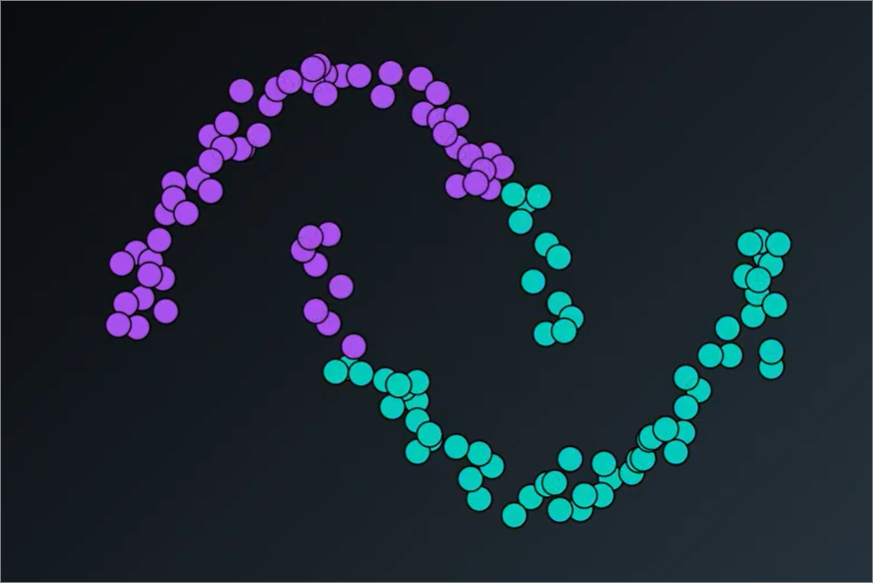

- K means would be useful in carving out the clusters if K value is high, however. But not 2 in the form of crescents

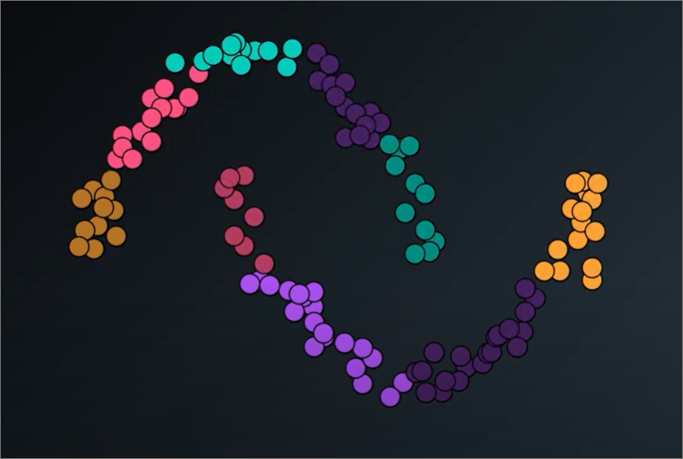

#### Summary of K-means clustering results
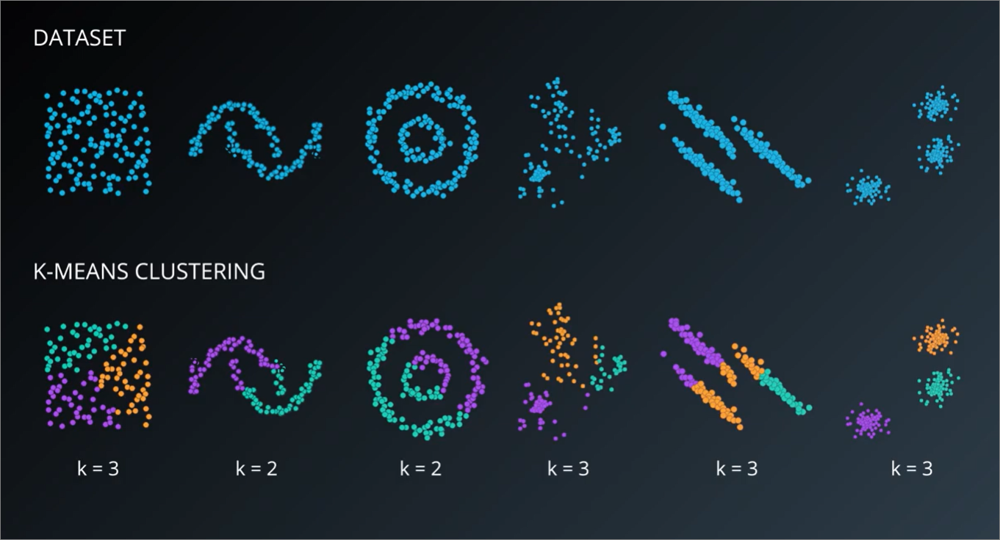

### Other clustring algorithms
1. Hierarchical - clusters based on inner clusters
2. DBSCAN - ignores noise and clusters based on densely packed data
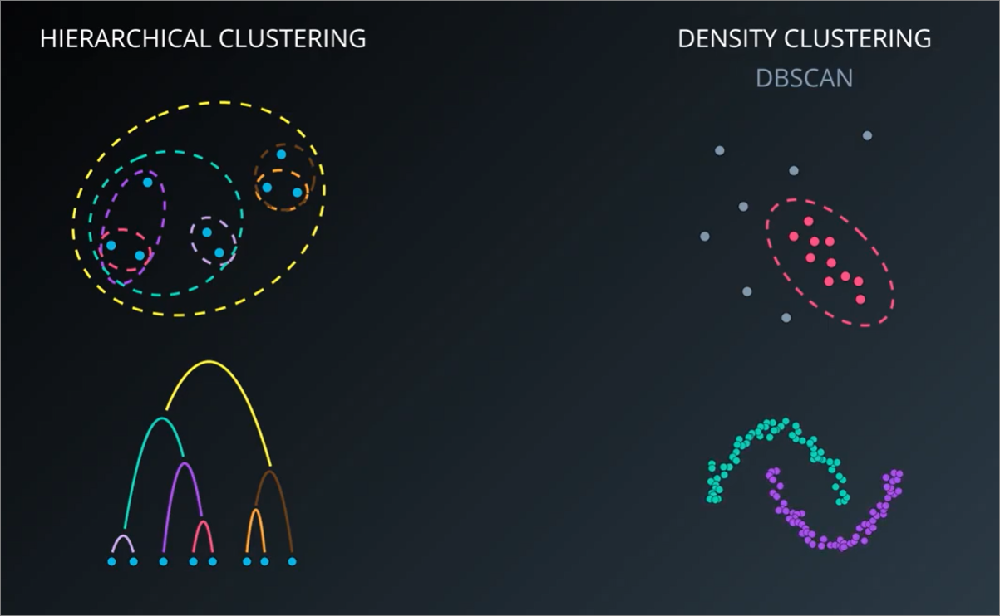

### Hierarchical clustering
#### Steps
1. Assume every data point is **one cluster**.
2. Calculate the distance between each cluster.
3. Find the closest two clusters and group them to form a new cluster. **[DEFINITION OF CLOSEST WOULD DEPEND ON DISTANCE MEASURE, i.e. single-link, complete, average]**
4. On the side, build a tree that links the clusters that have been grouped using a bracket.
5. Repeat from step 2 until you have a tree that encompasses the entire data points (**dendrogram**).
6. Based on the number of clusters, cut the tree to form different clusters
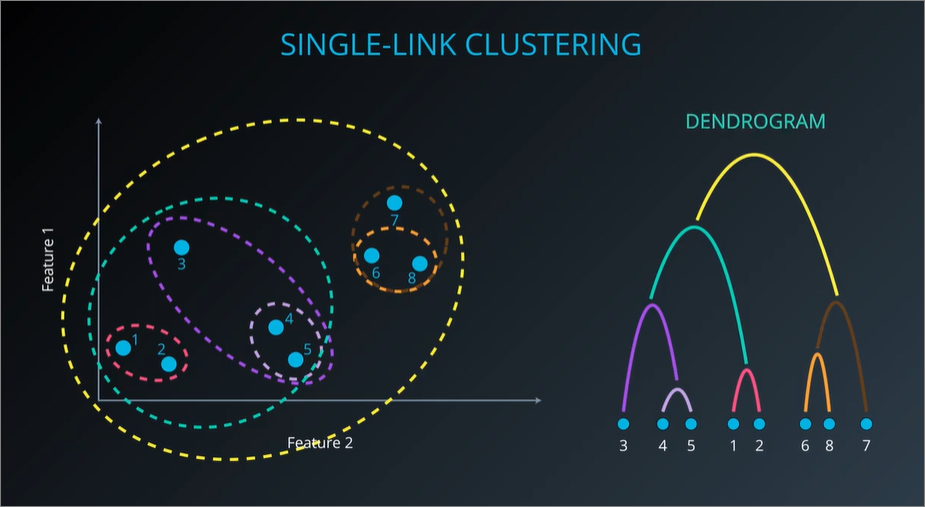

#### Agglomorate vs Divisive clustering
- Agglomorate (bottom-up)
- Divisive (top-down)
- Clustring methods below would belong to agglomorate category
- [Difference](https://towardsdatascience.com/hierarchical-clustering-agglomerative-and-divisive-explained-342e6b20d710#:~:text=Divisive%20Clustering%3A,one%20moves%20down%20the%20hierarchy.)

#### Single-link clustering
<ins>Explanation</ins>
- Links to **nearest single point** in each cluster
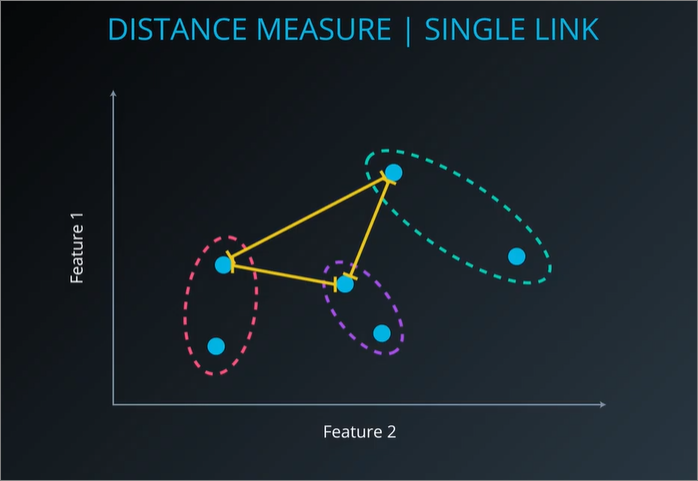

<ins>Disadvantage</ins>
- more prone to produce **elongated shapes**, or [long thin clusters](https://en.wikipedia.org/wiki/Single-linkage_clustering)
- Single link may **eat up** most of our dataset

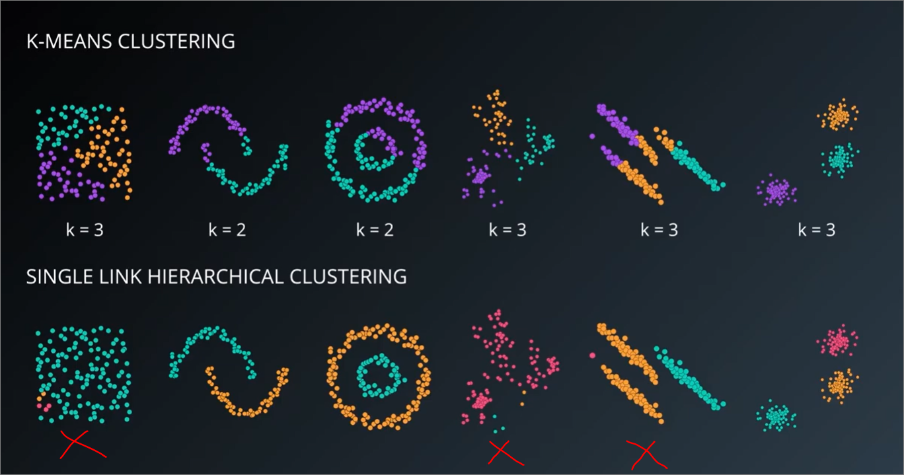

<ins>Dendrogram</ins>
- Dendrogram is a diagram that shows the hierarchical relationship between objects
- It is very useful when visualizing the hierarchical structure of the clusters, especially when the data is in high dimensions. We can produce a dendrogram in 2 dimensions to visualize datasets even if the data has multiple dimensions.
- `y axis` of dendrogram represents distance between clusters. So clusters are 'better split', if the distance is large
- [Interpreting dendrograms](https://youtu.be/3BzfOLnIY9w?t=319)
  - Thinking in terms of sensitivity, we can visualise placing a straight line across the dendrogram. If movements up/down of the dendrogram produces little variation of clusters (or no sudden increase of clusters), it may be a good cluster split.
  - Good cluster splits can be used to determine the number of `K` for k-means algorithm
  - However, need to be wary using this as determining number of clusters. 
  - [Where there is an obviously “correct” number of clusters this will often be evident in a dendrogram. However, dendrograms often suggest a correct number of clusters when there is no real evidence to support the conclusion.](https://www.displayr.com/what-is-dendrogram/)
- In image below, dendrogram 2,3 and 6 show good splits
- Eventhough dendrogram 4 and 5 doesn't produce good splits, it still does number of clusters, i.e. 3

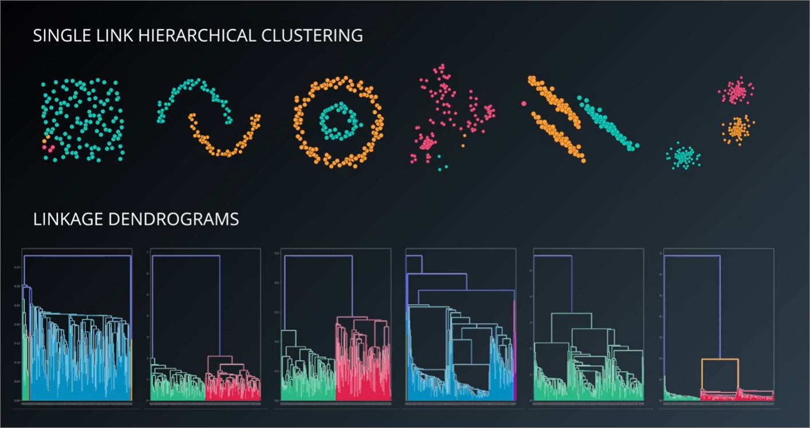

#### Complete-link clustering
<ins>Explanation</ins>
- Links to furthest **single point** in each cluster
- Better than single-link that clusters tend to be **more compact**.

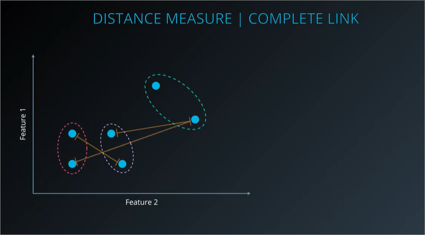

<ins>Disadvantage</ins>
- Similarly as single-link, disregards closer **sub-clusters** and only considers the furthest point

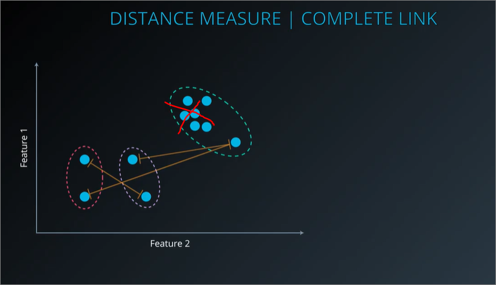

#### Average-link
- Average distance between point and every other point between clusters
- In example below, average distance of 4 connections will be calculated

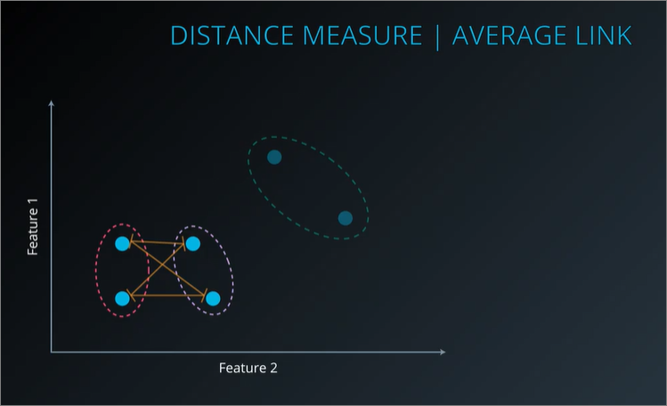

#### Wards-method
- Default method in `scikit-learn`
- Minimises variance when merging 2 clusters
- Steps
    1. Calculate **central point** between clusters
    2. Subtract variance in cluster, i.e. distance to central point **within** each cluster

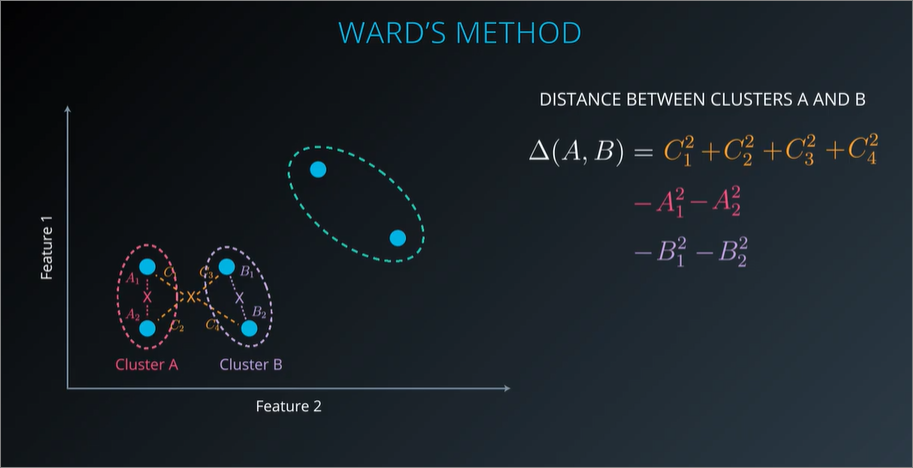

### Code
#### Using clustering algorithm in sklearn
1. Importing - `from sklearn import cluster`
2. Initialisation - `cluster.AgglomerativeClustering(n_clusters=3, linkage='ward')`
3. Fit, then predict similarly as kmeans

#### Visualising using dendrograms
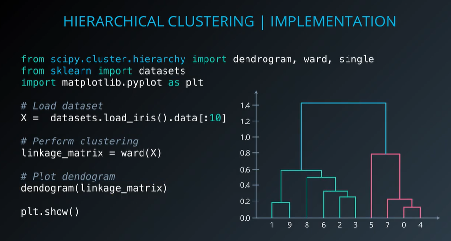

### Exercise 1 - `Hierarchical Clustering Lab.ipynb`
- Measuring score of clustering with `from sklearn.metrics import adjusted_rand_score`
  - `adjusted_rand_score(iris.target, ward_pred)`
- Similarly we would need to normalize our data
  - In our exercise, wards linkage produced a much better score after normalized data is fed into it.
- Can also visualize with seaborn's `clustermap`
  - x and y axis is not in-order
  - have dendrograms for both x and y axis
  - [Reference](https://medium.com/@kbrook10/day-4-data-visualization-how-to-use-seaborn-for-heatmaps-bf8070e3846e)

#### Quiz
- Because Single linkage looks at the closest point to the cluster, which means it pays attention solely to the area where the two clusters come closest to each other. Thus, it is more prone to result in **elongated shapes**.

### Advantages and disadvanrages of hierarchical clustering
**Advantages**:
1. The resulting hierarchical clustering representations are very informative. They provide us additional ability to visualize the structure of the dataset, e.g. **dendrograms**
2. It is very potent when the dataset **contains real hierarchical relationships**.

**Disadvantages**:
1. It is sensitive to outliers and noise so data needs to be cleaned up beforehand.
2. It is computationally intensive O(N^2)

### References
- [Example of using average linkage - Using Hierarchical Clustering of Secreted Protein Families to Classify and Rank Candidate Effectors of Rust Fungi.](http://journals.plos.org/plosone/article?id=10.1371/journal.pone.0029847)
- [Example of using complete linkage - Association between composition of the human gastrointestinal microbiome and development of fatty liver with choline deficiency](https://www.ncbi.nlm.nih.gov/pubmed/21129376)

### DBSCAN (Density based spacial clustring for applications with noise)
- Groups points which are closely packed together
- Identifies **noise**
- [Visualising DBScan](https://www.naftaliharris.com/blog/visualizing-dbscan-clustering/)

#### Visualising and describing clusters
- Cluster 1 is more compact
- Cluster 2 is more elongated

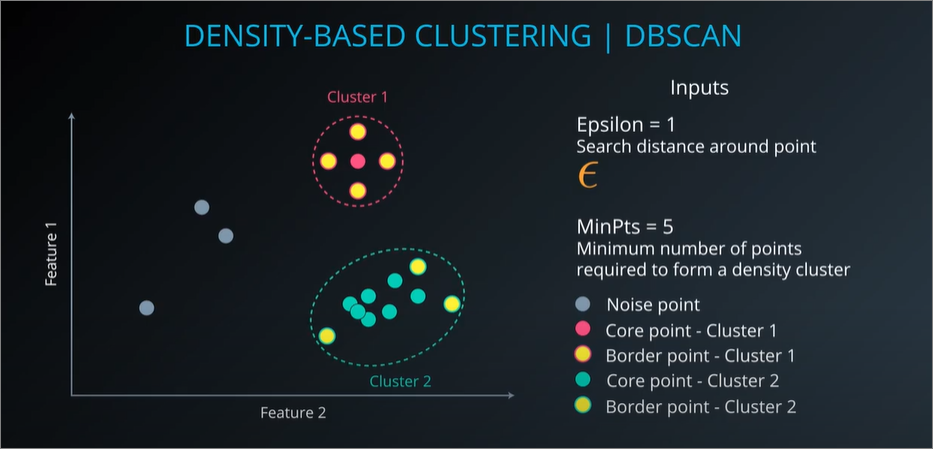

#### Parameters
1. Epsilon - distance that defines each points' neighbourhood
2. MinPts/min_samples - number of points in neighbourhood for a point to be regarded as **core-point**

#### Benefits of using DBSCAN
- If we want to cluster points based on density
- We want to identify noise in a dataset

#### Steps - reference video
1. Select a point arbitrarily.
2. Define a search area around the selected point using a predefined search distance `ϵ`
3. Search if there is any point in the search area.
    - (a) if there is not any point in the area, the selected point is labeled as noise.
    - (b) if there are points in the area, compare the number of points in the search area (including the selected point) to a predefined minimum number of points parameter MinPts.
      - (i) if the number of points is greater than MinPts, the selected point is a **core point** of a cluster, and other points in the search area are part of the same cluster.
      - (ii) if the number of points is smaller than MinPts, the selected point is **noise**.
4. Procced to each point in the cluster <ins>found above</ins> and search for point in its search area.
    - (a) if the number of points is greater than MinPts, the point is **also a core point** in the same cluster.
    - (b) if the number of points is smaller than MinPts, the point is a **border point** in the same cluster.
5. **Repeat** from step 1 until **all points are labeled as noise, core point, or border point.**

#### DBSCAN vs K-means
- For 4, 5, parameters of DBSCAN may need to be tweaked
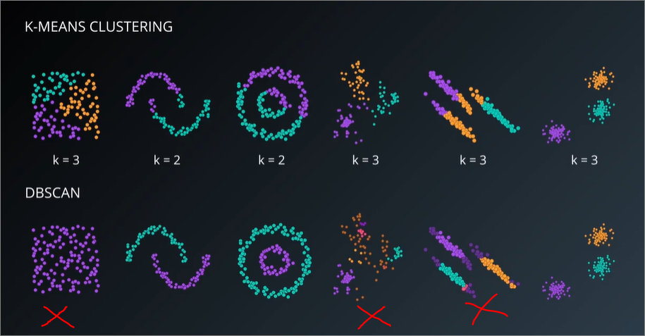

#### Code
**- Note:** Noise is labelled as `-1`
```
from sklearn import datasets, cluster

# Load dataset
X = datasets.load_iris().data

# Specify the parameters for the clustering. There are the defaults.
db = cluster.DBSCAN(eps=0.5, min_samples=5)
db.fit(X)


# 'db.labels_' now contains an array representing which cluster each point belongs to. 
# Samples labeled '-1' are noise.
```

#### Exercise
- refer `DBSCAN Notebook.ipynb`
  - Tweaking parameters, think `epsilon` and `min_samples` to be inverse

#### Advantages and disadvantages of DBSCAN
<ins>Advantage of DBSCAN</ins>
- **No need to specify** the number of clusters.
- It's flexible in the shapes and sizes of clusters.
  - Not biased to spherical (K-means) or elongated (single-link hierarchical)
  - Can still track dense clusters easily
- It handles **noise**.
- It handles **outliers** (i.e. indirectly may be noise).

<ins>Disadvantage of DBSCAN</ins>
- Border points that are reachable from two clusters are **assigned to the cluster that finds them first**. It's **not guaranteed to return the same clustering**.
  - However, most datasets do not face this issue
- It has difficulty finding clusters of **varying densities**.
  - to address this, we can use a variation of DBSCAN called `HDBSCAN`
  - [HDBSCAN - hierarchical density based clustering](https://www.researchgate.net/publication/315508524_hdbscan_Hierarchical_density_based_clustering)

#### References
- [Comparing K-means and DBSCAN in classifying network traffic](https://pages.cpsc.ucalgary.ca/~mahanti/papers/clustering.pdf)
- [Anomaly detection in temperature data using DBSCAN](https://ieeexplore.ieee.org/abstract/document/5946052/) 
  - Treating 'noise' as outliers/anomalies
  - Tweaking parameters = tweaking aggressiveness of anomaly detection
- [Statquest](https://www.youtube.com/watch?v=7xHsRkOdVwo)
  - Iteration that there are many ways to measure distance to clusters, e.g.
    - Euclidean distance (i.e. the square root of sum of squares)
    - Manhattan distance (sum of all distance)
    - etc, etc
  - For euclidean distance, there are also many ways to measure distance between clusters, single linkage, complete linkage, average linkage etc etc.
  - Choice over how to measure distance (euclidean/manhattan) or how to compute distance is arbitrary and depends alot on nature of dataset

## TODO
- to internalise ~~`dendrograms` and~~ scoring using `adjusted_rand_score` 
- to read `http://www.econ.upf.edu/~michael/stanford/maeb7.pdf`
- read use cases, below advantages and disadvantages
- internalise tweaking dbscan parameters
- internalise advantages/disadvantages between clustring algorithms