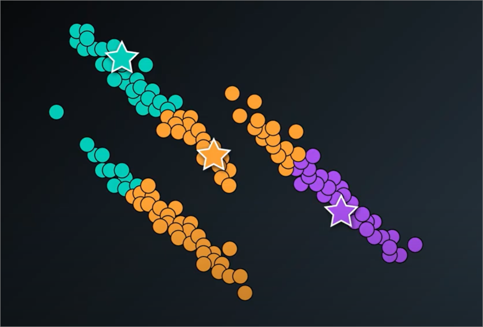

### Oveview
- Hierarchical clustering
    - Single-link clustering
    - Complete-link
    - Average-link
    - Ward's method
- Hierarchical clustering implementation
- Density based clustering (DBSCAN)
- DBSCAN implementation

### Follow up from K-means
- K means uses a **distance based** algorithm to identify clusters
- So it tends to form clusters which are circular/ spherical/ hyperspherical
- **E.g.** K-means wouldn't be able to carve out the following clusters since they are not circular


- 2 crescent dataset


- K means would be useful in carving out the clusters if K value is high, however. But not 2 in the form of crescents


#### Summary of kmeans clustering vs datasets


### Other clustring algorithms
1. Hierarchical - clusters based on inner clusters
2. DBSCAN - ignores noise and clusters based on densely packed data


### Hierarcical clustering
#### Single-link clustering 
- Links to nearest **single point** in each cluster
- not available in scikit-learn
- more pront to produce **elongated shapes**


#### Complete-link clustering
- Links to furthest **single point** in each cluster

Problem
- disregards closer **sub-clusters** and only considers the furthest point

#### Average-link
- Average distance between point and every other point


#### Wards-method
- default method in `scikit-learn`
- minimises variance when merging 2 clusters
- Steps
    1. Calculate central point between clusters
    2. Subtract distance to central point **within** each cluster


### Code
#### Using clustering algorithm in sklearn
1. Importing - `from sklearn import cluster`
2. Initialisation - `cluster.AgglomerativeClustering(n_clusters=3, linkage='ward')`
3. Fit, then predict similarly as kmeans

#### Visualising using dendrograms


### Exercise 1 - `Hierarchical Clustering Lab.ipynb`
- Measuring score of clustering with `from sklearn.metrics import adjusted_rand_score`
  - `adjusted_rand_score(iris.target, ward_pred)`
- Similarly we would need to normalize our data
  - In our exercise, wards linkage produced a much better score after normalized data is fed into it.
- Can also visualize with seaborn's `clustermap`

#### Quiz
1. Because Single linkage looks at the closest point to the cluster, which means it pays attention solely to the area where the two clusters come closest to each other. Thus, it is more prone to result in **elongated shapes**.

### Advanrages and disadvanrages of hierarchical clustering
**Advantages**:
1. The resulting hierarchical clustering representations are very informative. They provide us additional ability to visualize the structure of the dataset, e.g. **dendrograms**
2. It is very potent when the dataset **contains real hierarchical relationships**.

**Disadvantages**:
1. It is sensitive to outliers and noise so data needs to be cleaned up beforehand.
2. It is computationally intensive O(N^2)

### References
- [Example of using average linkage - Using Hierarchical Clustering of Secreted Protein Families to Classify and Rank Candidate Effectors of Rust Fungi.](http://journals.plos.org/plosone/article?id=10.1371/journal.pone.0029847)
- [Example of using complete linkage - Association between composition of the human gastrointestinal microbiome and development of fatty liver with choline deficiency](https://www.ncbi.nlm.nih.gov/pubmed/21129376)

### DBSCAN (Density based spacial clustring for applications with noise)
- groups points which are closely packed together
- [Visualising DBScan](https://www.naftaliharris.com/blog/visualizing-dbscan-clustering/)


#### Parameters
1. Epsilon - distance that defines each points' neighbourhood
2. MinPts/min_samples - number of points in neighbourhood for a point to be regarded as **core-point**

#### Benefits of using DBSCAN
- If we want to cluster points based on density
- We want to identify noise in a dataset

#### Steps
1. Select a point arbitrarily.
2. Define a search area around the selected point using a predefined search distance `ϵ`
3. Search if there is any point in the search area.
    - (a) if there is not any point in the area, the selected point is labeled as noise.
    - (b) if there are points in the area, compare the number of points in the search area (including the selected point) to a predefined minimum number of points parameter MinPts.
      - (i) if the number of points is greater than MinPts, the selected point is a **core point** of a cluster, and other points in the search area are part of the same cluster.
      - (ii) if the number of points is smaller than MinPts, the selected point is **noise**.
4. Procced to each point in the cluster <ins>found above</ins> and search for point in its search area.
    - (a) if the number of points is greater than MinPts, the point is **also a core point** in the same cluster.
    - (b) if the number of points is smaller than MinPts, the point is a **border point** in the same cluster.
5. **Repeat** from step 1 until **all points are labeled as noise, core point, or border point.**

#### Code
- Noise is labelled as `-1`
```
from sklearn import datasets, cluster

# Load dataset
X = datasets.load_iris().data

# Specify the parameters for the clustering. There are the defaults.
db = cluster.DBSCAN(eps=0.5, min_samples=5)
db.fit(X)


# 'db.labels_' now contains an array representing which cluster each point belongs to. 
# Samples labeled '-1' are noise.
```

#### Exercise
- refer `DBSCAN Notebook.ipynb`
  - Tweaking parameters, think `epsilon` and `min_samples` to be inverse

#### Advantages and disadvantages of DBSCAN
<ins>Advantage of DBSCAN</ins>
- **No need to specify** the number of clusters.
- It's flexible in the shapes and sizes of clusters.
  - Not biased to spherical (K-means) or elongated (single-link hierarchical)
- It handles **noise**.
- It handles **outliers** (i.e. indirectly noise).

<ins>Disadvantage of DBSCAN</ins>
- Border points that are reachable from two clusters are **assigned to the cluster that finds them first**. It's **not guaranteed to return the same clustering**.
  - However, most datasets do not face this issue
- It has difficulty finding clusters of **varying densities**.
  - to address this, we can use a variation of DBSCAN called `HDBSCAN`

#### References
- [HDBSCAN - hierarchical density based clustering](https://www.researchgate.net/publication/315508524_hdbscan_Hierarchical_density_based_clustering)
- [Comparing K-means and DBSCAN in classifying network traffic](https://pages.cpsc.ucalgary.ca/~mahanti/papers/clustering.pdf)
- [Anomaly detection in temperature data using DBSCAN](https://ieeexplore.ieee.org/abstract/document/5946052/) 


## TODO
- to internalise `dendrograms` and scoring using `adjusted_rand_score` 