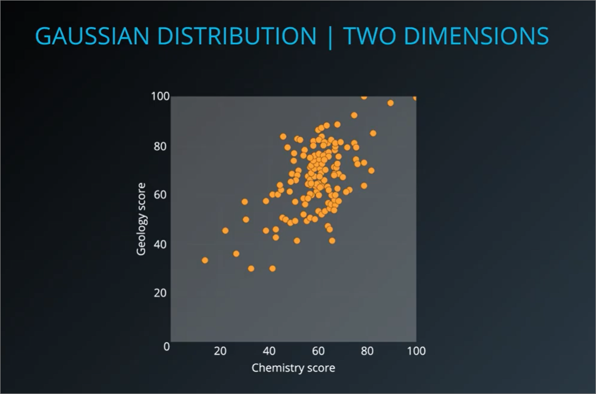
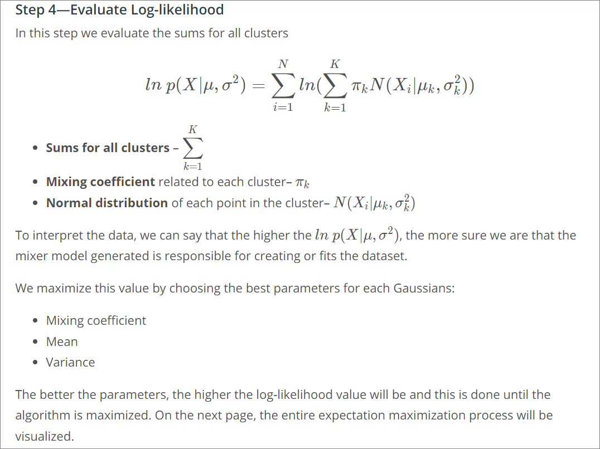

## Overview
1. Cluster data with Gaussian Mixture Models
    - Optimize Gaussian Mixture Models with Expectation Maximization
2. Understand the cluster analysis process
3. Evaluate results using cluster validation

## Gaussian Mixture Model
- Soft clustering model
- Each point in dataset would belong to all clusters, with difference members of membership
- Looks at all the points in a dataset
And clusters based on the shape of a Gaussian distribution that the data points seem to take


### Assumptions
1. Assumes each cluster would follow a **statistical distribution**, hence heavily relies on probability and statistics.
2. Uses **Gaussian/normal** distribution
    - Use cases:
      - Test scores
      - Height of people
      - Measurement errors


### Gaussian distribution
#### In 1 Dimension
- Plotted using **histogram**
- Height of histogram represents **concentration of points** in the range of values
- Plots into a **bell curve**


#### Numbers that describe Gaussian distribution
1. Mean or Average = `1` or `μ`
2. Standard deviation = `σ`
   - The areas that are **1 standard deviation more and less** than the mean contains 68% of the data and are represented as: `μ−1σ, μ+1σ`
   - The areas that are **2 standard deviations more and less** than the mean contains 95% of the data and are represented as: `μ−2σ, μ+2σ`
   - The areas that are **3 standard deviations more and less** than the mean contains 99% of the data and are represented as: `μ−3σ, μ+3σ`

#### How Gausian Mixture Model works
- Some dataset may contain multiple gaussian models
- `Scikit learn` scans the dataset and identifies that this is a gaussian mixture and forms 2 gaussian models
    - Plotting the histograms for the new data we see that they both follow Gaussian distributions, but with **different means and variance**


- Model **clusters data** with understanding/assumption that Gaussian distributions can be mixed or combined
- And with each cluster representing a **different distribution**.
- If points overlap between clusters, whichever point is determined to have a **higher probability** of belonging to a cluster will be classified as that cluster

#### Gaussian in 2 dimensions
- In example below, features represent **x and y axes**
- Each of the 2 variables/features would have
  - Its own gaussian distribution, this is called a **Multivariate Gaussian Distribution** (gaussian distribution in more than 1 variable)
  - Each set of scores has its own mean (μ) and std deviation (σ)


- Visualising it as **concentric circles**:
    - The center of the circles represents the **mean μ** of the axis of the variables
    - The innermost circle represents the mean plus and minus the standard deviation `μ−1σ, μ+1σ`, it contains 68% of the data points
    - The next circle out from the innermost circle represents `μ−2σ, μ+2σ`, it contains 95% of the data points
    - The outermost circle represents `μ−3σ, μ+3σ`, it contains 99% of the data points

#### Performing GMM on 2D (Visualisation with example)
- Imagine 2 datasets being represented as 2 **Multivariate gaussion distributions** for 2 years of test scores. Plotted by Chemistry / Geology in x / y


- If the 2 years' datasets are combined, we can use GMM to retrieve the original 2 years data



#### How GMM works (using example above)
**Uses Expectations Maximisation (EM) Algorithm**
1. Initialize K Gaussian Distributions – where K is the number of clusters
    - In example above, we set k as 2 since there are 2 years
    - Also need to estimate random mean an std div for 2 clusters (k values) above
    - We can use k-means to plot the preliminary clusters (and maybe derive our mean and std div?)

    

2. Soft-Cluster Data – expectation step or E-step
    - Use formula below (**Probability Density function of a Normal Distribution**) to calculate probability/**membership in each cluster** using x feature values, mean and std div
    - Last cluster probability can be calculated using `1 - (probabilities of being in previous clusters)`
    - In example below, there is a `99.976% probability` that it will be **Cluster A**
    - The variable `Z` represents a hidden/latent variable in the cluster. `E[Z1A]` is the expectation of point 1 belongs to cluster A and a large value means point 1 has a high probability to be part of cluster A.

    

    - We then create a soft clustering as follows, points overlapping between Cluster A and B may have 50/50 probabilities
    - We then use this soft clustering to **estimate new Gaussians**

    

3. Re-estimate the Gaussians - maximization step or M-step
    - recalculate (i) **mean** and (ii) **std-deviation (weighted version)**
    
    

    - Comparing distributions below would show that Cluster B slowly edges towards Cluster A

    

4. Evaluate Log-likelihood – to check for convergence
    - The better the parameters, the higher the value of log-likelihood
    - [Udacity video](https://www.youtube.com/watch?time_continue=212&v=B_xXd0mFUm4&feature=emb_logo)
    

5. If the data converges then return results. However, if there is no convergence, return to step 2 until convergence occurs.
    - Convergence happens if our log-likelihood increases a fractional value (something like performing gradient descent until our derivative is very very close to zero)

#### Convergence
- Example of bad convergence below, since it failed to segregate the 2 clusters
  - Random initialisation of parameters (mean/stddiv)
  - Spherical covariance = gaussian is provided with only mean and covariance


- Better initialisation
  - Initialisation - using K-means (default in `sklearn.matrix`)
  - Covariance matrix (default `full` in sklearn)


### Code
```
from sklearn import datasets, mixture

# Load dataset
X = datasets.load_iris().data[:10]

# Specify the parameters for the clustering
gmm = mixture.GaussianMixture(n_components=3)
gmm.fit(X)
clustering = gmm.predict(X)

# "clustering" now contains an array representing which
# each point belongs to:
# [1 0 0 0 1 2 0 1 0 0]
```

### Advantages and disadvantages
#### GMM Advantages :
1. **Soft clustering** – sample membership of multiple clusters, for example, classifying documents into multiple topics or categories
2. **Cluster shape flexibility**
    - cluster can contain another cluster inside it

#### GMM Disadvantages :
1. **Sensitive to initialization values**
2. Possible to **converge to a local optimum**
3. **Slow convergence rate**

### GMM examples
1. [Nonparametric discovery of human routines from sensor data](http://citeseerx.ist.psu.edu/viewdoc/download?doi=10.1.1.681.3152&rep=rep1&type=pdf)


2. [Application of the Gaussian mixture model in pulsar astronomy](https://arxiv.org/abs/1205.6221)


3. [Speaker Verification Using Adapted Gaussian Mixture Models](http://citeseerx.ist.psu.edu/viewdoc/download?doi=10.1.1.117.338&rep=rep1&type=pdf)
4. [Adaptive background mixture models for real-time tracking](http://www.ai.mit.edu/projects/vsam/Publications/stauffer_cvpr98_track.pdf)
    - https://www.youtube.com/watch?v=lLt9H6RFO6A

#### GMM quiz
- Differentiating between multivariate gaussian distributions and gaussian mixtures
  - `3_gmmquiz.pdf`
- Importance of value initialisation and covariance type
  - `3_gmmquiz2.pdf`

## TODO
- Difference multivariate, mixed gaussian distributions
- internalise log-likelihood
- what is convergence to local optimum?
- Convergence slow - how slow compared to other algorithms?
- What is covariance type?