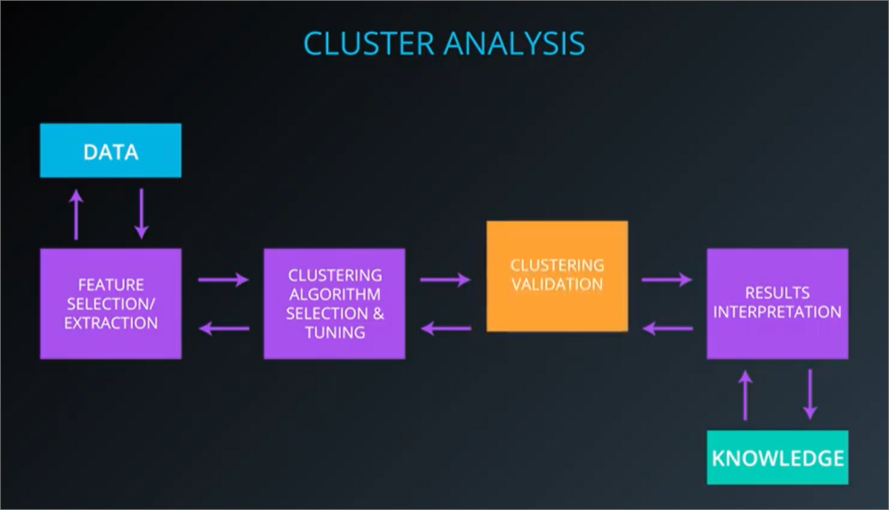
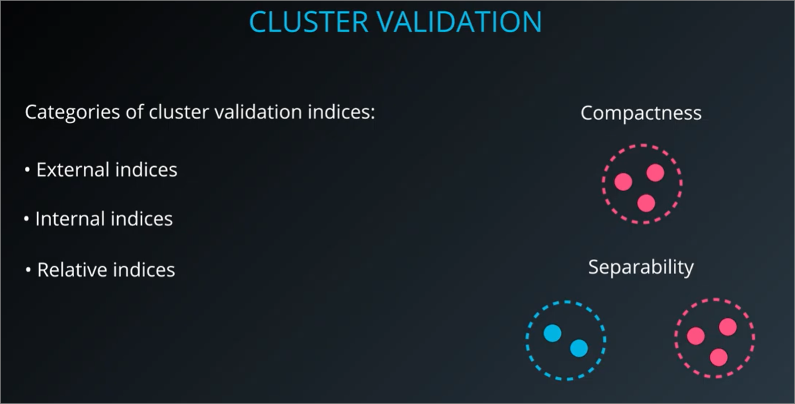
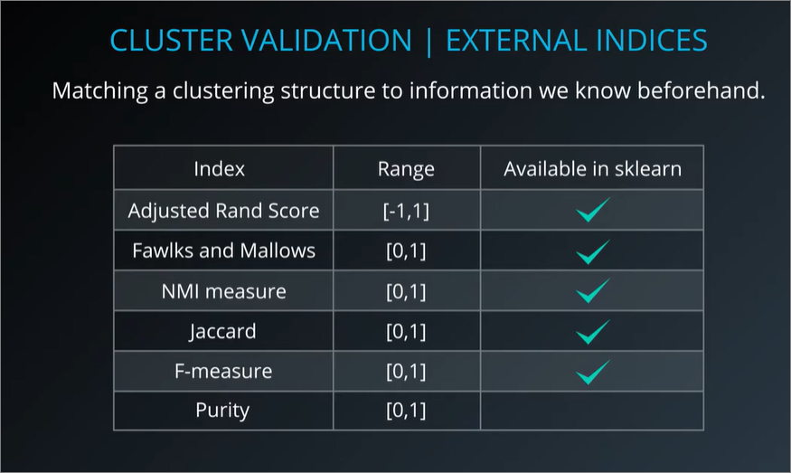
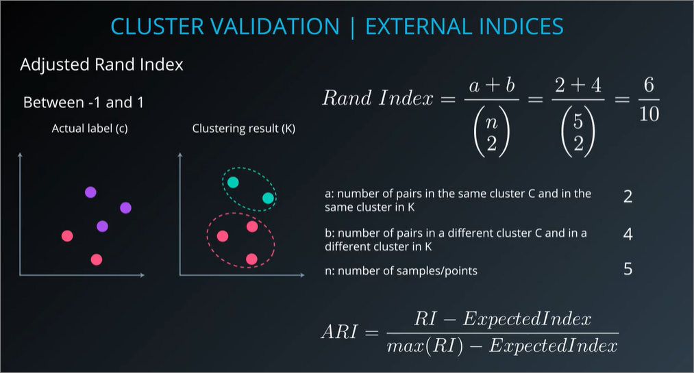
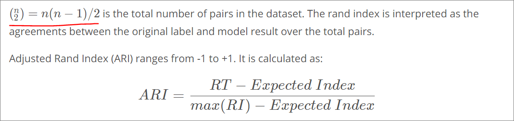
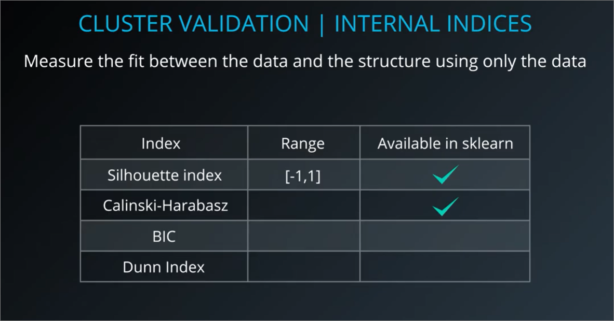

## Cluster Analysis

### Cluster analysis process covers the following:
1. **Feature selection and feature extraction**
    - <ins>Choose the best</ins>/distinguishing features in the dataset needed for analysis
      - to reduce dimensionality of dataset since higher dimensions may take more time to train
    - <ins>Transform</ins> data to generate additional new and useful features, using principal component analysis (PCA)

2. **Choose a clustering algorithm**
    - Make the selection using best results based on your <ins>**use case**</ins>
      - very subjective here
    - Choose a <ins>proximity measure</ins> – in this lesson we've used **euclidian distance** to measure the distance between two points.
      - However if the data is text based, **cosine distance** may be more appropriate. 
      - If the data is more of a gene expression, **Pearson's correlation** may be best.

3. **Clustering validation**
    - Evaluating how well a clustering performed based on: 
      - <ins>visualizations</ins> and, 
      - using a clustering <ins>validation index/ formulas</ins>

4. **Results and Interpretation**
    - What can be understood from the clustering structure, using <ins>background knowledge and domain expertise</ins>
      - labelling clusters etc...

### Cluster Validation
    Process of objectively and quantitatively evaluating the results of clustering.

#### Types of validation indices
1. **External** indices – used to score clustering model performance when a dataset is **labeled**
2. **Internal** indices – used to measure the fit between data and structure using only the data, when the dataset is **unlabeled**, as in unsupervised learning
3. **Relative** indices – used to indicated **which of two** clustering structures is "better"
    - `All internal indices can serve as relative indices`

#### How Validation Indices are defined
1. Compactness – a measure of **how close** the **elements of a cluster** are to each other
2. Separability – a measure of **how far** or distinct **clusters are from each other**

Ideal clusters
- elements of cluster are most compact/similar
- clusters are most distinct/separate from each other

#### External validation indices
- Used when we have labels for our dataset

#### Rand index
- Definition: Agreements **between the original label and model** result **over the total pairs**.
- Adjusted rand index (ARI)= discounting rand index
  - Further details of [adjusted rand index](http://faculty.washington.edu/kayee/pca/supp.pdf)
  - A higher ARI value indicates a better clustering result

#### Code
- use of `datasets.make_blobs` to simulate gaussian datasets
- How to visualise data with 4 dimensions?
  - There are a few ways (e.g. PairGrid, t-SNE, or project into a lower number number dimensions using PCA). Let's attempt to visualize using PairGrid because it does not distort the dataset -- it merely plots every pair of features against each other in a subplot:

#### Exercise
1. `GMM Clustering and Cluster Validation Lab.ipynb`

#### Internal validation indices

<ins>Visualising in terms of k-means</ins>
- K=4 and K=5, gets penalised because there isn't enough distance between the clusters

#### Silhouette coefficient
1. Rewards compactness, circular clusters
2. Silhouette coefficient shouldn't be used for DBSCAN since it doesn't understand the concept of outliers/noise
   - DBSCAN also tend not to have compact clusters, so the score will be lower
   - Instead use [DBCV](http://citeseerx.ist.psu.edu/viewdoc/download;jsessionid=83C3BD5E078B1444CB26E243975507E1?doi=10.1.1.707.9034&rep=rep1&type=pdf) for DBSCAN
3. Downsides

## TODO
- What does it mean to discount rand index?