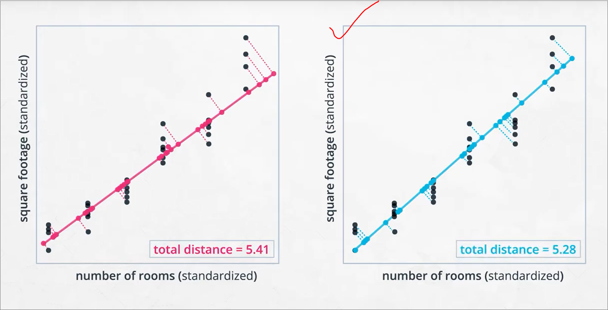
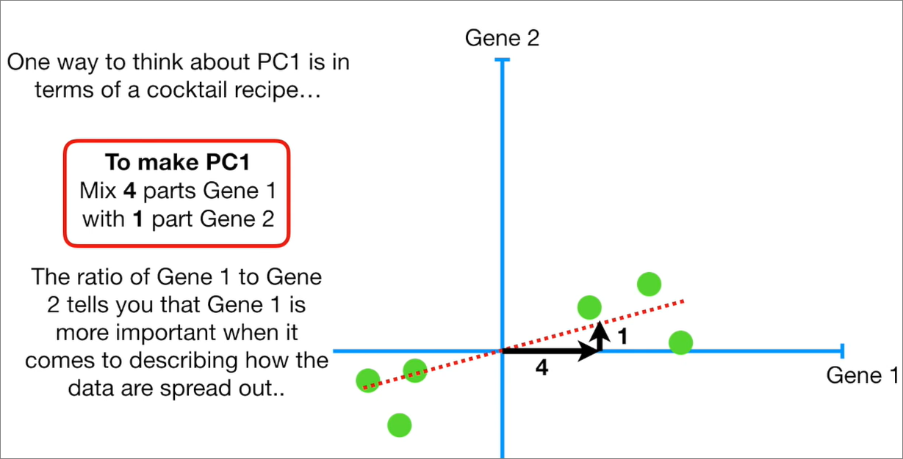

## Principal Component Analysis (PCA)
### Summary
- Identifying important parts of data, and have less of it
- Previously, unsupervised learning techniques are aimed at **clustering**. Right now we're **transforming data** instead of clustering them
- PCA aims at dimensionality reduction, i.e. taking your full dataset and **reducing it to only the parts that hold the most information**.


Math for PCA is largely based on linear algebra

### Overview
Udacity only covers to extent over how it will be used, not much over how it is implemented. Basically at higher level of abstraction.

1. **Dimensionality Reduction through Feature Selection and Feature Extraction** - With large datasets, we often suffer from what is known as the <ins>"curse of dimensionality,"</ins> and need to reduce the number of features to effectively develop a model. <ins>Feature Selection</ins> and <ins>Feature Extraction</ins> are two general approaches for reducing dimensionality.

2. **Feature Extraction using PCA** - Principal Component Analysis is a common method for extracting new <ins>"latent features"</ins> from our dataset, based on existing features.

3. **Fitting PCA** - Use PCA in scikit-learn to <ins>reduce the dimensionality</ins> of datasets.

4. **Interpreting Results** - There are two main parts to interpreting your results - the <ins>principal components themselves</ins> and the <ins>variability of the original data captured by those components</ins>.

### Latent Features
- Features that are **not directly observed**, but underlies other features that are observed.
- In terms of PCA, latent features would be PC1, PC2 etc...
- So for example below we can reduce the features from 6 to just 2


### Curse of dimensionality
- From our example above, there are only 6 features, models typically can handle these no problem
- But the "curse of dimensionality" becomes more clear when we're grappling with large real-world datasets that might involve hundreds or thousands of features
- We may then need to reduce the number of dimensions/features

#### [Intuition over curse of dimensionality](https://stats.stackexchange.com/questions/65379/machine-learning-curse-of-dimensionality-explained)
```
Let's say you have a straight line 100 yards long and you dropped a penny somewhere on it. It wouldn't be too hard to find. You walk along the line and it takes two minutes.

Now let's say you have a square 100 yards on each side and you dropped a penny somewhere on it. It would be pretty hard, like searching across two football fields stuck together. It could take days.

Now a cube 100 yards across. That's like searching a 30-story building the size of a football stadium. Ugh.

The difficulty of searching through the space gets a lot harder as you have more dimensions. You might not realize this intuitively when it's just stated in mathematical formulas, since they all have the same "width". That's the curse of dimensionality. It gets to have a name because it is unintuitive, useful, and yet simple.
```

### How to reduce features and condense them to latent features?
- Reference - refer to `feature selection and extraction.pdf`
1. Feature selection
    - finding **subset** of original features of dataset that we determine are most relevant and useful.
    - in example below, we only use `floor plan size` and `local crime rate`
        
    - methods include:
      - **Filter methods** - ranking or sorting algorithm to find best features. E.g. Pearson's Correlation, Linear Discriminant Analysis (LDA), and Analysis of Variance (ANOVA)
      - **Wrapper methods** - select features by directly testing their impact on the performance of a model, 'wrap' this procedure when calling model(s) with different feature subsets. E.g. Forward Search, Backward Search, and Recursive Feature Elimination.

2. Feature extraction
    - **extracting or constructing** new features called latent features
    - in example below, `Size Feature` and `Neighborhood Quality Feature` are new latent features
        
    - methods include:
        - Principal Component Analysis (PCA)
        - Independent Component Analysis (ICA)
        - Random Projection

3. Feature selection vs extraction
- The latent features can be constructed to incorporate data from multiple features in **feature extraction**, and thus retain more information present in the various original inputs
- Rather than just losing that information by dropping many original inputs in **feature selection**.


### Principal components (PCs)
- Essentially the latent features "constructed" using PCA
- Constructing **PC1** is very similar to drawing a best fit line in linear regression. However the **purpose** of lines in both are very different:
  - PCA - to shrink 2D data to a 1D line
  - Regression - the line is our **model** for prediction
    

- Principal components are **linear combinations** of the original features in a dataset that aim to retain the most information in the original data. In example above it is the best fit line

#### 2 Properties of PCs
1. Each component captures the largest amount of variance left in the data. Aka - They retain the most amount of information in the dataset.
    - i.e. each component would find the best fit line
    - Each subsequent PCs will make sure to reduce the amount of **information lost**, i.e. to minimise the distance from the best fit line.
    - However from the statquest video, actual PCA is not measured in this way, i.e the perpendicular distance between points and line.
    

2. Components are orthogonal with each other
    - Orthogonal = perpendicular lines which touch each other

#### Exercise
- refer `PCA_SC.ipynb`
- refer `PCA_1.ipynb`
- code using `confusion matrix` and `heat maps`
- If more features are included, it may lead to overfitting of our data. Here accuracy eventually levels off after around 30-40 PCs


### Interpreting PCA results
- Using a scree plot to visualise how much % of variability is explained by PCA created
- Displays individual and cumulative variability explained
  - The amount of variance explained by each component. This is called an **eigenvalue**.
- The principal components themselves, each component is a vector of weights. In this case, the principal components help us understand which pixels of the image are most helpful in identifying the difference between digits. Principal components are also known as **eigenvectors**.
- refer to `eigenvector eigenvalues.pdf` for more details

### Exercise
- refer `Interpret_PCA_Results_SC.ipynb`
- refer `Interpret_PCA_Results.ipynb`
- code using `heat maps` to display heavy and light weights for each pixel

### Use cases of PCA
1. PCA for [microarray data](https://www.ncbi.nlm.nih.gov/pmc/articles/PMC2669932/).
2. PCA for [anomaly detection](https://arxiv.org/pdf/1801.01571.pdf).
3. PCA for [time series data](http://citeseerx.ist.psu.edu/viewdoc/download?doi=10.1.1.853.2380&rep=rep1&type=pdf).

#### Disadvantages
- PCA may come at the cost of reducing your data **interpretability (understandability)**

### Exercise
- refer `PCA_Mini_Project.ipynb`
  - Exercise focuses on displaying results to show positive and negative weights for each PC
  - Also ranks PCs and states the feature weights for all features
  - We can use scree plot to explain variance per principal component

## [Statquest PCA](https://www.youtube.com/watch?v=FgakZw6K1QQ)
### Purpose
1. To allow visualisation of 4D (or more) data (i.e. with 4 features & above) to a 2D plot
2. PCA to tell us how accurate the 2D plot is
3. How PCA can tell us which variables are most valuable

### Steps for dataset with 2 features
1. Move data to origin - position of data relative to each other doesn't change
2. Fit line through origin between points
    - by measuring distance between data points and line (the less the better)
    - by measuring distance from origin to perpendicular points of line (the more the better)
    - **c** is computed by summing all squared distances from origin to projected point on line for each data point.
      - PCA calls sum of squared distances for best fit line the **Eigenvalue**
      - and the square root of the Eigenvalue is the **Singular Value** for PC1 


3. The fitted line is PC1, think of it as a cocktail mix
    - PC1 is a **linear combination** of gene 1 and gene 2



4. The `4:1` parts above is scaled down by using the hypotenuse **scaled to 1**
    - This 1 unit long vector, consisting of **0.97** parts Gene 1 and **0.242** parts Gene 2 is called the **Singular Vector** or **Eigenvector** for PC1


5. Since this is a 2D data, PC2 is simply the line through the origin that is perpendicular to PC1


6. To draw final PCA plot
    - Rotate so PC1 is horizontal
    - Plot points on PCA


7. Variation % can be calculated using Eigenvalues, i.e. Sum of squared distances for PCs


### How does it translate to 3D and above?
1. Same steps as above
2. However, we just need to perform best fitting line **more times**
    - E.g. for a 3D data, PC2 must be perpendicular to PC1, but it also must find its own best fit by rotating along its perpendicular position.
    - PC3 would then be the final line which is perpendicular to PC1 and PC2
3. Most of the times, PC1 and PC2 would account for majority of the variation, so we can easily plot a 2D graph using these 2 PCs


4. Sometimes, PC3 and above may account for majority of variances
5. However noisy data can still aid clustering


### [Practical Tips](https://www.youtube.com/watch?v=oRvgq966yZg&t=8s)
1. Make sure data is scaled
2. Make sure PCA algorithm centers our data, or else we would need to do it ourselves
3. How to determine number of Principal Components (PCs)?
    - If we have only 2 data points for a 2D dataset, PC1 would explain 100% of the variation, since the best fitting line is basically drawing a line between the 2 points
4. Number of observations would put an upper bound to our PCs


### [When to use PCA](https://www.youtube.com/watch?v=hJZHcmJBk1o)
1. To understand latent features driving patterns in data
2. Dimensionality reduction
    - Visualise high dimensional data in 2D
    - Reduce noise (with the assumption that PCs which explains smaller variations are noise)
    - Make other algorithms work better with fewer inputs

## TODO
- ~~How PCA works.~~
  - Read summary pdf
- Don't think PCA uses gradient descent for best fit line, so how does it find the line?
- What are latent features in PCA sense

- Have intuition over **what explaining variability means** when interpreting pca
- References - refer `Intro to Machine Learning with Pytorch - PCA references.pdf`
- ~~What does orthogonal mean?~~
  - Orthogonal is **perpendicular line whichs touch each other**
- What is the significance of it being orthogonal
- In exercise, why do features have negative weights?
- What are least and most favourable components?
- need to learn more about feature selection?
- Explore more over resources for feature selection and extraction
- **Internalise variation and PCA feature weight relation**