## Summary
### Outline
1. Random projection
2. Implement random projection in scikit-learn
3. Independent component analysis (ICA)
4. FastICA algorithm
5. Implement ICA in scikit-learn
6. Some ICA applications

### Random Projection
- Dimensionality reduction algorithm
- Computationally more efficient than PCA
  - Used for datasets with too many features for PCA to be computationally viable, e.g. hardware is to limiting or PCA just cannot perform well on such a large dataset

#### Contrast to PCA
- For each principal component in PCA, the line of best fit would be found. This may be computationally expensive since we need to compute the line with the least differences
- In random projection, a random line would be used for each PC (not best fit)
- Althrough it doesn't make sense to be used on datasets with low number of features, it works very well for datasets with alot of features
- Time complexity of random projection much better than PCA
- PCA and Random Projection all have **orthogonal** lines

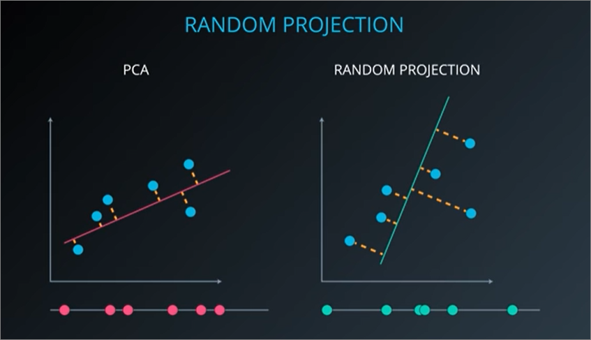

#### Steps
1. Performs transformation from higher dimension to lower with a **random matrix**

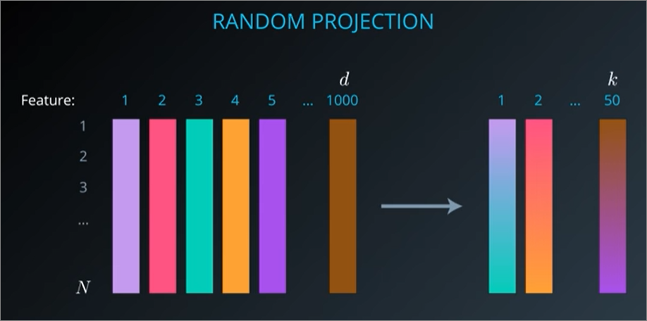

- transformed dataset = X, 
- random projection matrix = R, 
- original dataset = X

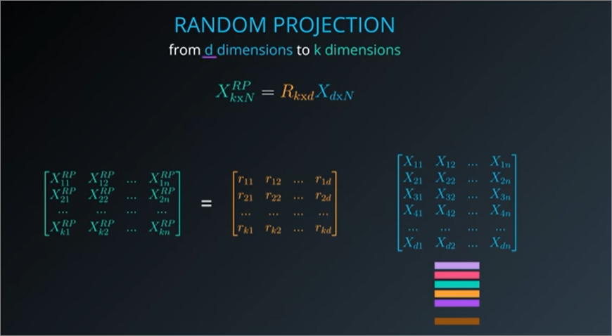
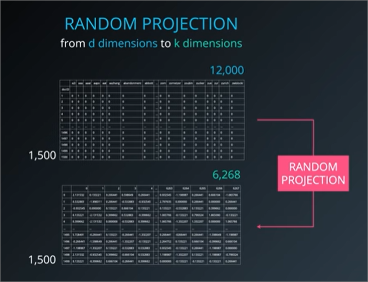

#### How it works
- Emphasis over **preservation of distance between points** as many of our supervised/unsupervised algorithms utilise distance as a measure
  - It may be distorted a little, but can be mostly preserved

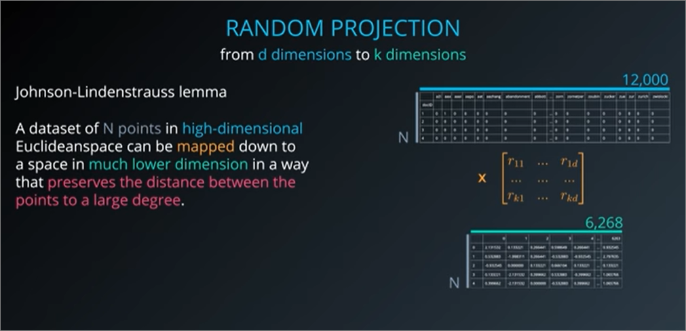

#### Tweaking hyperparameters
- Epsilon = how much preservation of distance do we value
  - Thus, it also determines how many columns (`k`) are produced.
- Indirectly relates to the level of distortion/error our **random projection allows** for matrixes before and after projection / reduction of dimensionality
- sklearn default value is `0.1`
  - range from `0` to `1`

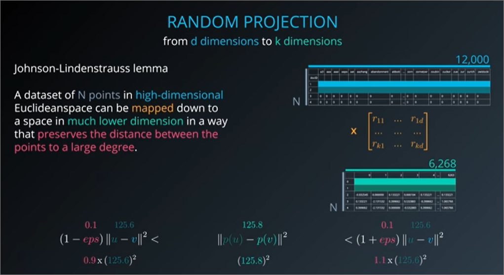

#### References
1. [Random projection in dimensionality reduction: Applications to image and text data](http://citeseerx.ist.psu.edu/viewdoc/download?doi=10.1.1.76.8124&rep=rep1&type=pdf)
    - paper shows this on real-world datasets including noisy and noiseless images of natural scenes, and text documents from a newsgroup corpus.
2. [Random Projections for k-means Clustering](https://papers.nips.cc/paper/3901-random-projections-for-k-means-clustering.pdf)
    - uses Random Projection as an efficient dimensionality reduction step before conducting k-means clustering on a dataset of 400 face **images** of dimensions 64 × 64

#### Quiz
1. Random Projection indeed delivers higher performance than PCA especially in higher dimensional data -- with a decrease in quality of projection, however.
2. Number of components is optional and can also be computed by algorithm
    - Random projection can indeed work either by setting a number of components or by specifying a value for epsilon and having the algorithm calculate a conservative value for the number of dimensions.

#### Code
- `SparseRandomProjection` more performant
- optional to include number of components
```
from sklearn import random_projection

# Sparse random projection is faster. There's also Gaussian random projection.
# You can declare a value for Epsilon or a specific number of components here
rp = random_projection.SparseRandomProjection()

# Get the new dataset
new_X = rp.fit_transform(X)
```

#### Exercise
- `Random_Projection.ipynb`

0. Reminder that it is optional to set n_components since it can be computed by algorithm
    - and default for `eps is 0.1`
1. Random projection still preserves accuracy even if half of our features are removed
2. Epsilon and number of components form
    - higher epsilon = lower number of components
    - high epsilon = higher buffer for distortion so naturally lower dimensions would be preferred

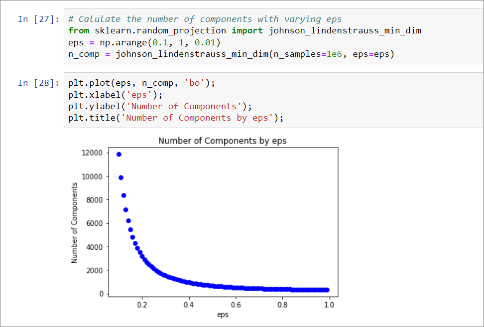

3. Comparison of `n_components`
- Pairwise distance distributions
  - lower n_components = less precise
    - tend to form circular shape and distance is spread
  - higher n_components = more precise
    - tend to form more linear straight line and less spread
- Pairwise distance ratio
  - higher n_components = less sacrifice of distance during dimension reduction
    - ratio tend to be near to 1
  - lower n_components = more variation over distance before and after reduction
    - ration more spread out 

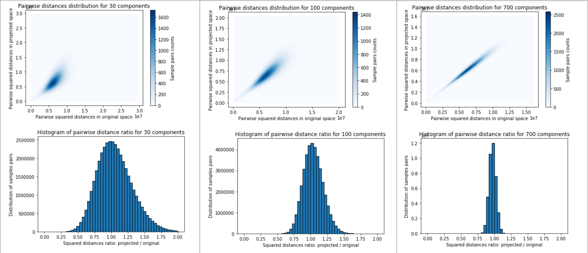


### Independent Component Analysis (ICA)
- Similarly as PCA and Random Projection -> ICA produces a new set of features

#### Assumption
- assumes that the features are mixtures of **independent** sources, and it tries to **isolate** these independent sources from the mixture.

#### Visualisation with cocktail party problem
1. Picture room with 3 sources of sound, which are **independent** of each other
    - There are individuals in the room who records the sounds at different distances 

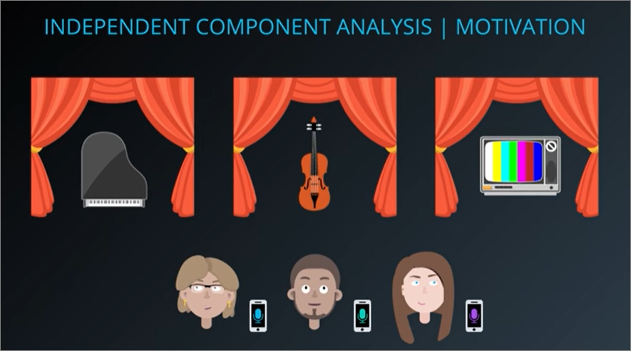

2. Sounds recorded would have different degrees of sound relating to the 3 sources above

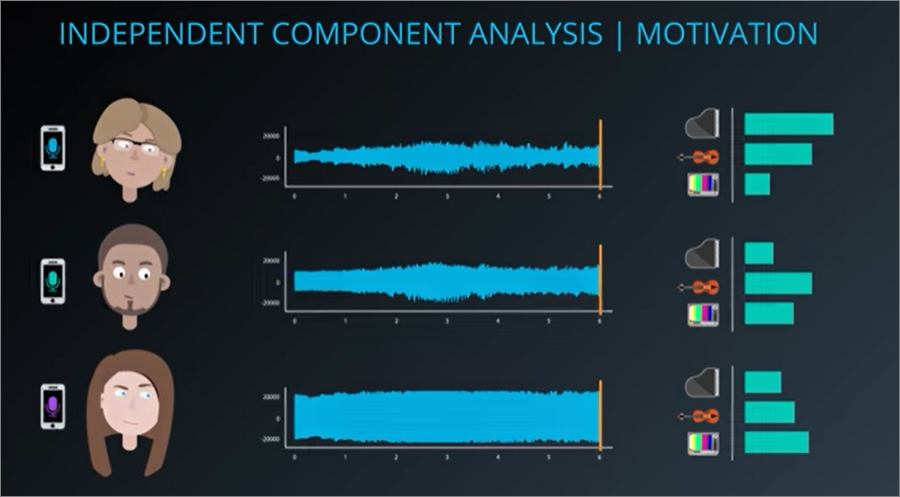

3. ICA is able to output and isolate each of the sources
    - This is also called **blind source separation**

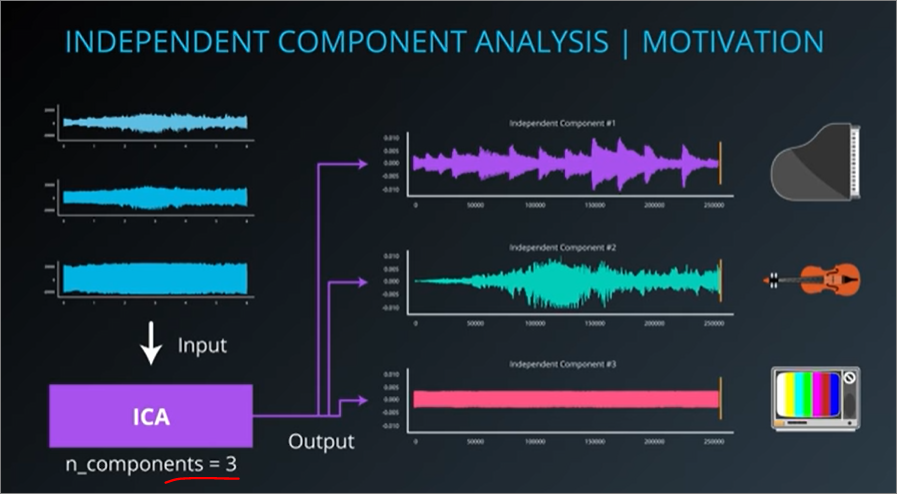

#### FastICA Algorithm (implemented in `sklearn`)
- High level overview
- Purpose: to find the best `W` (i.e. unmixing matrix)

<ins>Mixing matrix and un-mixing matrix</ins>

<ins>Assumptions</ins>
1. It assumes that the components are **statistically independent**
2. It assumes that the components must have **non-Gaussian distribution**.

#### Quiz
1. Two audio recordings of a conversation is a good candidate for ICA especially if the two microphones are successful in capturing different levels of the voices of the two speakers
2. ICA needs as many observations as the original signals we are trying to separate.

#### Code
- each signal variable is an **array**
```
from sklearn.decomposition import FastICA

# Each 'signal' variable is an array. e.g. audio waveform
X = list(zip(signal_1, signal_2, signal_3))
# Pass the number of orignial components we want to retrieve
ica = FastICA(n_components=3)
components = ica.fit_transform(X)

# components now contains the independent components retrieved via ICA
```

#### Exercise
- `Independent Component Analysis Lab.ipynb`

#### Applications
1. Used alot in medical scanners, EEGs or fMFRIs
    - to isolate and identify which part of brain causes signals

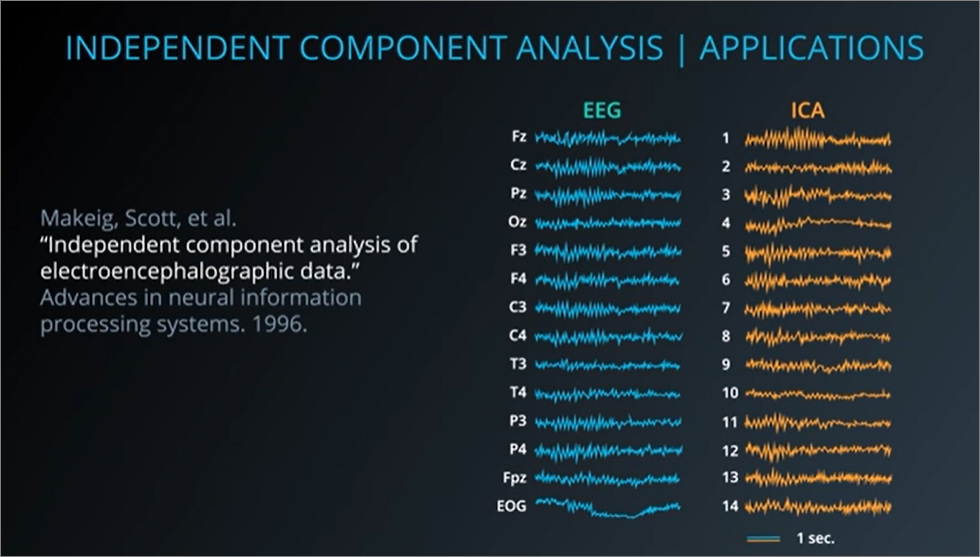
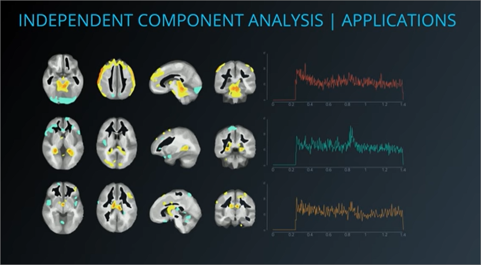

2. Financial data
    - Not as useful but interesting?

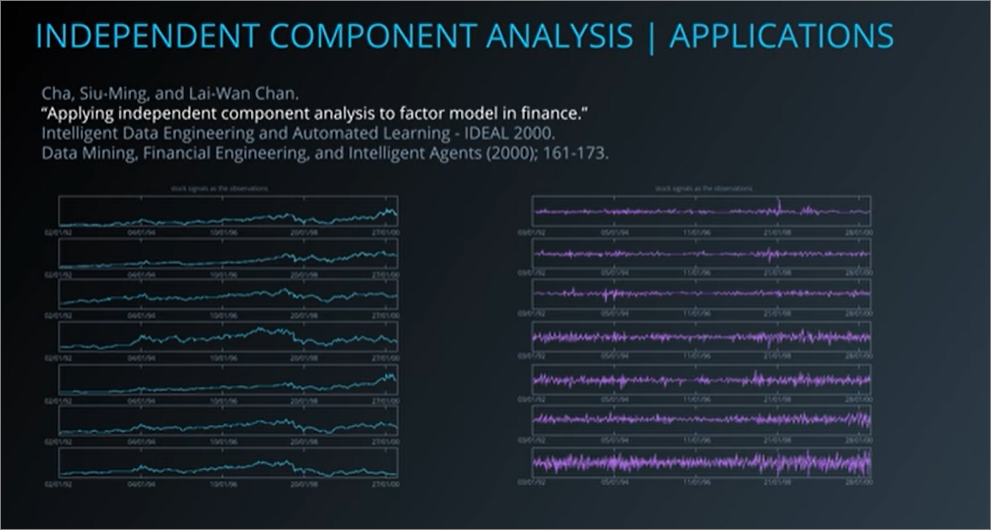
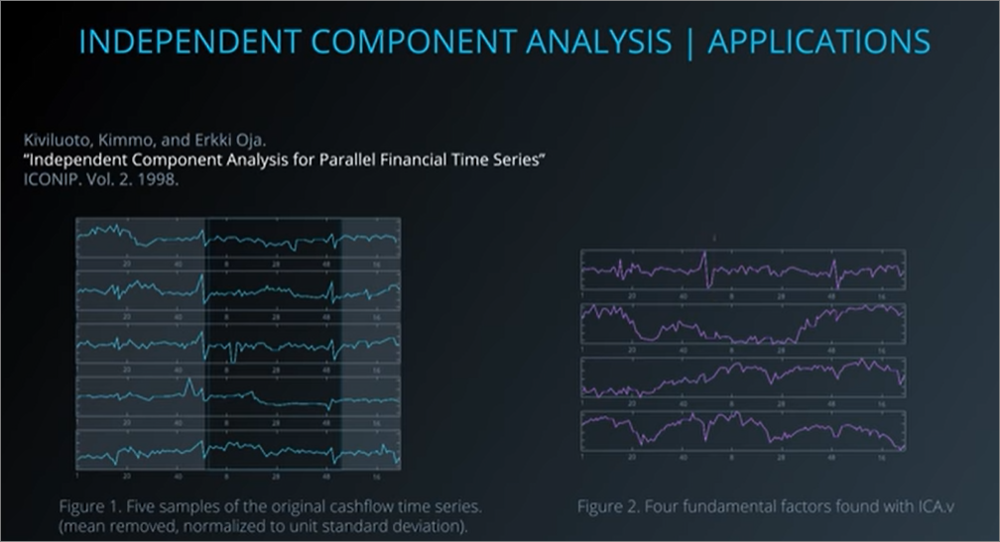

## TODO
- How similar is pcA to random projection?
- Revisit ICA